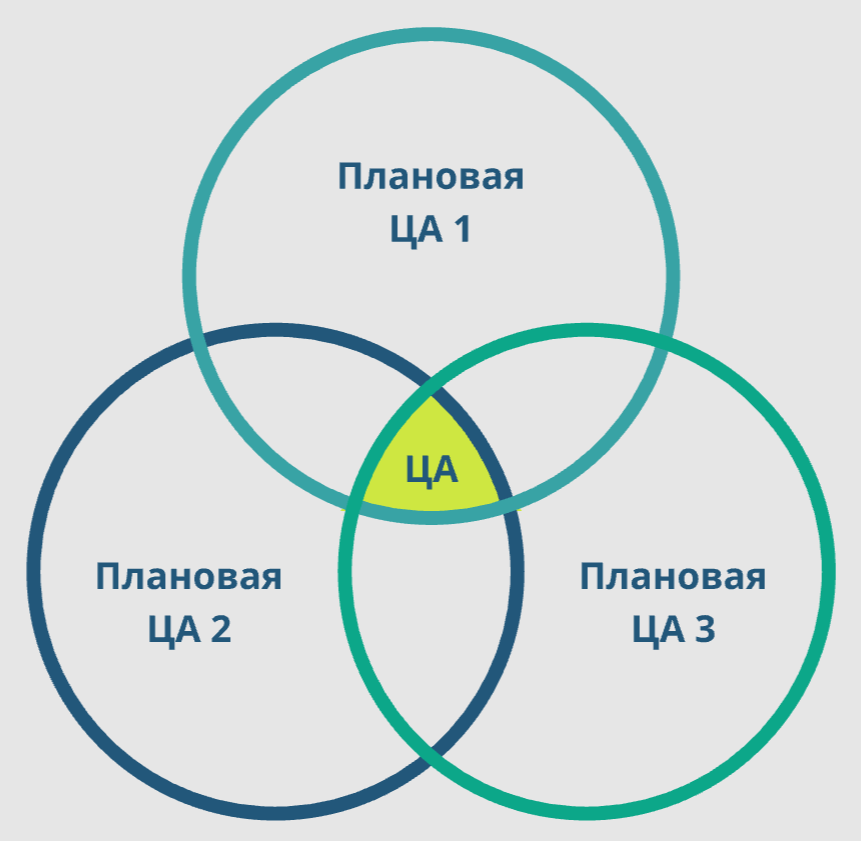
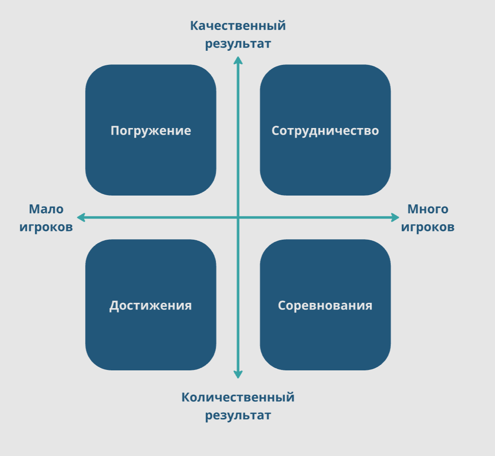
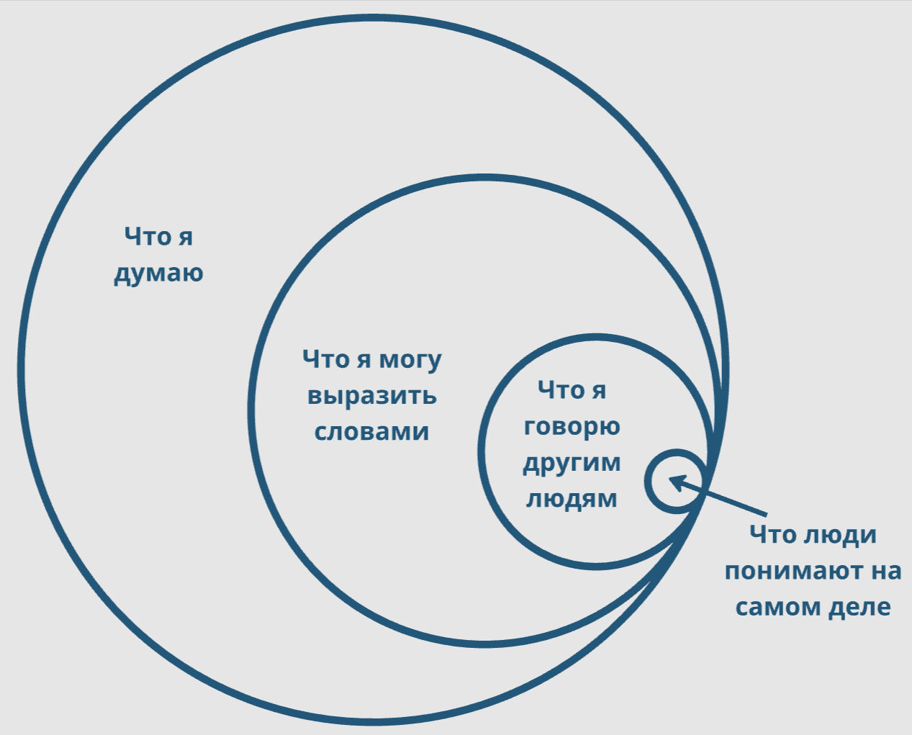

# Категоризация аудитории

🦓🛸⌛**Дисклеймер: **материал находится в процессе доработки. Если вы в чем-то несогласны с актуальным материалом — это нормально, мы тоже с ним не во всем согласны.

**[1] - [5]**

## Зачем категоризировать (делить на категории, группы) аудиторию?
----

Чтобы понимать:

1. Какую игру от нас ждут;
1. Сколько нам за нее готовы заплатить;
1. Где искать/привлекать игроков;
1. И т. д.

Аудитория категоризируется рынком. Категория игроков, выделенный **сегмент рынка** — это группа игроков, которая обычно характеризуется следующими параметрами:

- географическое положение
- культура
- интересы
- навыки
- достаток и распределение трат
- доступные технологии
- и т. д.

Есть множество систем анализа и категоризации (в том числе целевой) аудитории, а также ее потребностей. Изучите [пирамиду потребностей Маслоу](https://ru.wikipedia.org/wiki/%D0%9F%D0%B8%D1%80%D0%B0%D0%BC%D0%B8%D0%B4%D0%B0_%D0%BF%D0%BE%D1%82%D1%80%D0%B5%D0%B1%D0%BD%D0%BE%D1%81%D1%82%D0%B5%D0%B9_%D0%BF%D0%BE_%D0%9C%D0%B0%D1%81%D0%BB%D0%BE%D1%83), [теорию психотипов Бартла](https://en.wikipedia.org/wiki/Bartle_taxonomy_of_player_types), [BrainHex](http://survey.ihobo.com/BrainHex/), [8 удовольствий Марка Лебланка](http://algorithmancy.8kindsoffun.com/), [16 мотивационных характеристик Рейcа](https://psychology.wikia.org/wiki/16_basic_desires_theory_of_motivation) ([еще ссылка на систему мотивации Рейса](https://www.reissmotivationprofile.com/)), [16-факторный личностный опросник](https://ru.wikipedia.org/wiki/16-%D1%84%D0%B0%D0%BA%D1%82%D0%BE%D1%80%D0%BD%D1%8B%D0%B9_%D0%BB%D0%B8%D1%87%D0%BD%D0%BE%D1%81%D1%82%D0%BD%D1%8B%D0%B9_%D0%BE%D0%BF%D1%80%D0%BE%D1%81%D0%BD%D0%B8%D0%BA).

Некоторые системы анализа аудитории делят людей по следующим принципам:

- «что у них есть» — возраст, пол, достаток…
- «что они могут» — строить, крафтить, гриндить…
- «что они хотят» — дружить, воевать…

А мы остановимся только на нескольких, часто используемых и при этом не очень напоминающих [гороскоп](https://ru.wikipedia.org/wiki/%D0%93%D0%BE%D1%80%D0%BE%D1%81%D0%BA%D0%BE%D0%BF).

**Совет!**

!!! info ""
    Часто начинающие творцы видят в себе ЦА разрабатываемого продукта. Рассуждают они следующим образом: «Мне же нравится игра А? Значит, если я сделаю игру Б и она мне понравится — она понравится и всем тем, кому нравится игра А». Предоставляю вам самим оценить ошибочность такого мышления.

## Возраст и пол
 **[6]**

----

Самый очевидный классический способ категоризации аудитории: по возрасту и полу.

Здесь все более-менее понятно, однако старайтесь не объединять в одну группу людей разного пола, семейного положения и нескольких [возрастных кризисов](https://ru.wikipedia.org/wiki/%D0%9D%D0%BE%D1%80%D0%BC%D0%B0%D1%82%D0%B8%D0%B2%D0%BD%D1%8B%D0%B5_%D0%BA%D1%80%D0%B8%D0%B7%D0%B8%D1%81%D1%8B_%D1%80%D0%B0%D0%B7%D0%B2%D0%B8%D1%82%D0%B8%D1%8F). Если обобщение «мальчики и девочки 7–9 лет» еще допустимо, то «мужчины  и женщины 18–30» с точки зрения геймдева - несуществующая аудитория (в других же областях таковая аудитория вполне может существовать). Просто потому что большинство людей на этом возрастном этапе:

1. Поступают в институт или колледж, а может быть, идут в армию;
1. Устраиваются на работу, потом на другую, часто вообще меняя несколько профессий;
1. Создают семью (некоторые - несколько раз), заводят детей;
1. Переживают потерю друга/родственника/близкого человека.

Каждый из этих моментов влияет на человека, изменяя его мировоззрение и интересы.

Как правило, игровые проекты ориентируются на несколько возрастных групп, различных [когорт](https://ru.wikipedia.org/wiki/%D0%9A%D0%BE%D0%B3%D0%BE%D1%80%D1%82%D0%B0_(%D0%B4%D0%B5%D0%BC%D0%BE%D0%B3%D1%80%D0%B0%D1%84%D0%B8%D1%8F)) и [сегментов](https://ru.wikipedia.org/wiki/%D0%A1%D0%B5%D0%B3%D0%BC%D0%B5%D0%BD%D1%82%D0%B0%D1%86%D0%B8%D1%8F_%D1%80%D1%8B%D0%BD%D0%BA%D0%B0), зачастую перекрывающихся. Например, «мужчины, студенты 18–23» и «мужчины, семейные, без детей 21–27».

Из больших промежутков можно сводить, например, возраст 25–35 лет — это разброс вокруг возрастного кризиса 27-ми лет, который у некоторых начинается чуть раньше, а в современных реалиях, как правило, сильно задерживается.

Естественно, мы можем просто объединять аудиторию по принципу «люди 18–30 лет, которым понравится наша игра». Но различий у представителей такой группы будет больше, чем общих черт, и наша аудитория развалится на несколько узких подгрупп.

Вот что на самом деле происходит при столкновении нескольких аудиторий в одном проекте, если изобразить это с помощью [диаграммы Эйлера — Венна](https://ru.wikipedia.org/wiki/%D0%94%D0%B8%D0%B0%D0%B3%D1%80%D0%B0%D0%BC%D0%BC%D0%B0_%D0%92%D0%B5%D0%BD%D0%BD%D0%B0):

Как видите, вместо того, чтобы получить в два раза больше, мы получили от силы треть. Если мы хотим свести в один проект тех, кому нравится глубокая драма и [шутеры](https://ru.wikipedia.org/wiki/%D0%A8%D1%83%D1%82%D0%B5%D1%80), мы получим только тех, кто готов терпеть шутеры ради драмы, и тех, кто готов закрыть глаза на драму ради шутера. Много ли будет таких игроков?

Помните, **целевая аудитория — это всегда четкий таргет/когорта/сегмент**. Иначе это не целевая аудитория, а вся аудитория игры или вообще вся аудитория, которая вам (возможно) доступна.

## Сегментация аудитории по мотивации
  **[7]**

----

Проблема широко известной [теории психотипов Бартла](https://en.wikipedia.org/wiki/Bartle_taxonomy_of_player_types) в том, что она сделана под [MUD](https://ru.wikipedia.org/wiki/%D0%9C%D0%BD%D0%BE%D0%B3%D0%BE%D0%BF%D0%BE%D0%BB%D1%8C%D0%B7%D0%BE%D0%B2%D0%B0%D1%82%D0%B5%D0%BB%D1%8C%D1%81%D0%BA%D0%B8%D0%B9_%D0%BC%D0%B8%D1%80)’ы — древние прообразы [MMORPG](https://ru.wikipedia.org/wiki/%D0%9C%D0%B0%D1%81%D1%81%D0%BE%D0%B2%D0%B0%D1%8F_%D0%BC%D0%BD%D0%BE%D0%B3%D0%BE%D0%BF%D0%BE%D0%BB%D1%8C%D0%B7%D0%BE%D0%B2%D0%B0%D1%82%D0%B5%D0%BB%D1%8C%D1%81%D0%BA%D0%B0%D1%8F_%D1%80%D0%BE%D0%BB%D0%B5%D0%B2%D0%B0%D1%8F_%D0%BE%D0%BD%D0%BB%D0%B0%D0%B9%D0%BD-%D0%B8%D0%B3%D1%80%D0%B0).

Соответственно, эта теория сильно ограничена спецификой игровых механик данного жанра и уже банально устарела, даже с учетом [расширяющей ее Explicit/Implicit надстройки](https://en.wikipedia.org/wiki/Bartle_taxonomy_of_player_types#Expanded_categories). Возможно, если бы в ранних MUD можно было крафтить снаряжение и строить дома, психотипов в теории было бы больше.

В [шутеры с видом от первого лица](https://ru.wikipedia.org/wiki/%D0%A8%D1%83%D1%82%D0%B5%D1%80_%D0%BE%D1%82_%D0%BF%D0%B5%D1%80%D0%B2%D0%BE%D0%B3%D0%BE_%D0%BB%D0%B8%D1%86%D0%B0) приходят те, кто любит [FPS](https://ru.wikipedia.org/wiki/%D0%A8%D1%83%D1%82%D0%B5%D1%80_%D0%BE%D1%82_%D0%BF%D0%B5%D1%80%D0%B2%D0%BE%D0%B3%D0%BE_%D0%BB%D0%B8%D1%86%D0%B0), а не какие-то абстрактные «[киллеры](https://en.wikipedia.org/wiki/Bartle_taxonomy_of_player_types)». Более того, в [PvP](https://ru.wikipedia.org/wiki/PvP)-шутеры приходят те, кто хочет социализироваться, так как, и это может быть для кого-то открытием, игра против других игроков — это вполне себе форма социального взаимодействия.

Какая может быть социализация в [однопользовательской игре](https://ru.wikipedia.org/wiki/%D0%9E%D0%B4%D0%BD%D0%BE%D0%BF%D0%BE%D0%BB%D1%8C%D0%B7%D0%BE%D0%B2%D0%B0%D1%82%D0%B5%D0%BB%D1%8C%D1%81%D0%BA%D0%B0%D1%8F_%D0%B8%D0%B3%D1%80%D0%B0)? Как бы странно это ни звучало, но большинство игроков без проблем социализируется с [NPC](https://ru.wikipedia.org/wiki/%D0%9D%D0%B5%D0%B8%D0%B3%D1%80%D0%BE%D0%B2%D0%BE%D0%B9_%D0%BF%D0%B5%D1%80%D1%81%D0%BE%D0%BD%D0%B0%D0%B6), в момент игры воспринимая их как живых людей. И, помимо «прямой» социализации в игре, нужно учитывать «косвенную» вне игры: «*О, я тоже в это играл, давайте ее обсудим!*»  **[8][9]**

С другой стороны, очевидное достоинство теории Бартла — понятность и простота применения. Именно поэтому ее до сих пор можно встретить во многих опросниках, продюсерских планах и паспортах проекта.

Но в 2011 году [Jon Radoff](https://en.wikipedia.org/wiki/Jon_Radoff) предложил куда более гибкую и, как мне кажется, более внятную [four-quadrant model of player motivations](https://meditations.metavert.io/p/game-player-motivations) ([видео презентации](https://www.youtube.com/watch?v=I79icpye_PQ), в которой, кстати, довольно много говорится о нарративе):

Согласно этой модели, игроки мотивируются четырехлистником:

1. **Immersion** — погружением,
1. **Cooperation** — сотрудничеством,
1. **Achievement** — достижениями,
1. **Competition** — соревнованиями,

— разложенным по осям: **много** или **мало игроков** взаимодействует между собой в игре и **качественный** или **количественный результат** они преследуют.

Игры с большим количеством игроков ([MMO](https://ru.wikipedia.org/wiki/%D0%9C%D0%B0%D1%81%D1%81%D0%BE%D0%B2%D0%B0%D1%8F_%D0%BC%D0%BD%D0%BE%D0%B3%D0%BE%D0%BF%D0%BE%D0%BB%D1%8C%D0%B7%D0%BE%D0%B2%D0%B0%D1%82%D0%B5%D0%BB%D1%8C%D1%81%D0%BA%D0%B0%D1%8F_%D0%BE%D0%BD%D0%BB%D0%B0%D0%B9%D0%BD-%D0%B8%D0%B3%D1%80%D0%B0)), ориентированные на получение качественного результата, привлекают игроков с мотивацией к кооперации и, в свою очередь, мотивируют привлеченных игроково кооперировать — см. открытые серверы [Minecraft](https://www.minecraft.net/ru-ru) и различные MMO-выживачи. Просто потому что вместе можно сделать что-то реально крутое. MMO, ориентированные на количественный результат (убить 50 врагов, остаться последним выжившим), тяготеют к соревновательному геймплею и соответствующим игрокам, см. [PUBG](https://store.steampowered.com/app/578080/PUBG_BATTLEGROUNDS/). Однако, и тут можно без труда придумать исключения: например, [гриферы](https://ru.wikipedia.org/wiki/%D0%93%D1%80%D0%B8%D1%84%D0%B5%D1%80) в Minecraft.

Если хотите, можете взглянуть на свою игру под таким углом, а уже через него оценить потребности и возможности целевой аудитории. Но лучше всего будет отталкиваться от сегментации, которую диктуют механики игровой платформы и/или сама аудитория.

**Совет**

!!! info ""
    В маркетинге принято задавать такой вопрос: кем пользователь будет себя ощущать, используя наш товар? Ну знаете, с [Axe](https://www.axe.com/) он почувствует себя неотразимым ловеласом, с [BMW]() молодым, современным и уверенным. Взгляните так на свою игру:
    
    * Кем будет ощущать себя пользователь, играя в вашу игру?
    * Что игрокам захочется делать в вашей игре?
    * Какую потребность пользователей решает ваша игра?

## Сегментация аудитории от NewZoo
----

Коротко остановимся на [системе сегментации аудитории](https://newzoo.com/news/introducing-newzoos-gamer-segmentation-the-key-to-understanding-quantifying-and-reaching-game-enthusiasts-across-the-world/), которую использует в своих маркетинговых исследованиях аналитическая компания [Newzoo](https://newzoo.com/).

Специалисты Newzoo делят аудиторию на:

1. **Ultimate Gamers** (супергеймеры) — без ума от игр, играют и любят вообще все игры
1. **All-Round Enthusiasts** (универсалы) — как и супергеймеры, тоже играют во все, но для них это — любимое развлечение, а не образ жизни.
1. **Time Fillers** (скучающие) — в основном мобильные геймеры, играющие в свободное время, в поездках или во время работы/учебы.
1. **Bargain Buyers** (ловцы скидок) — они любят хорошие игры, но ждут на них скидки и покупают новое железо, только если игра без него не идет.
1. **Community Gamers** (тусовщики) — для них самое главное — это игровое сообщество, они зависают в социальных сетях и обсуждают игры.
1. **Hardware Enthusiasts** (железячники) — скупают топовое оборудование и меряются fps.
1. **PopCorn Gamers** (любители) — сами играют очень мало, но любят смотреть обзоры и стримы.
1. **Backseat Viewers** (зрители) — раньше играли очень много, но теперь на это нет времени и они смотрят стримы и обзоры.
1. **Lapsed Gamers** (бывшие игроки) — когда-то играли очень много, а теперь переключились на другие интересы.

Официального перевода этих «терминов» пока не существует, но [здесь](https://newzoo.com/insights/articles/overview-newzoos-gamer-segmentation-and-gamer-personas) вы можете изучить их подробное описание, а [здесь](https://resources.newzoo.com/hubfs/Newzoo_Gamer_Segmentation.pdf) увидеть детализированную, но чуть устаревшую модель. После ознакомления с этой системой вам будет проще понять, как именно сегментируют аудиторию продюсеры, PR’щики и маркетологи проекта.

## _
----

Работая с аудиторией, не стоит забывать меткое наблюдение, высказанное [Джесси Шеллом](https://www.jesseschell.com/) в книге «[Гейм-дизайн. Как создать игру, в которую будут играть все](https://www.ozon.ru/context/detail/id/151117665/)» (далее — перевод А. Ласенко):

!!! info ""
    *...вне зависимости от того, для какой возрастной группы вы делаете игру, все игровые действия связаны с детством, так как все детство – это игра. **Когда вы создаете игру для конкретной возрастной группы, следует ознакомиться со всеми темами и играми, популярными на тот момент, когда они были детьми.** Иными словами, чтобы общаться с кем-то по-настоящему, вам нужно говорить на языке его детства...*

Ну и совсем простой совет, позволяющий четко сфокусироваться на целевой аудитории: **описывая вашего игрока, представляйте его визуально**. Как он одет, с кем живет и с кем дружит, чем занимается, когда не играет в компьютерные игры.

Но если вы списываете аудиторию с себя — знайте, что создавать для самого себя легко, но для аудитории равной тебе — практически невозможно. Когда вы делаете что-то для себя, вы большую часть своих идей оставляете в голове и просто додумываете то, что хотите «сказать».  Но у других людей в голове нет ваших мыслей, а других «таких, как вы» игроков скорее всего не хватит на аудиторию даже очень маленькой игры — ведь вы еще и разработчик, а нас интересуют именно игроки.

***Мы осознаем меньше, чем знаем, формулируем хуже, чем осознаем, транслируем меньше, чем формулируем.*** **[10]**

Как только мы пытаемся сформулировать какую-то мысль — она становится менее понятной и глубокой, чем пока была у нас в голове. Соответственно, аудитория поймет ее куда меньше, чем нам бы хотелось.

Чтобы сделать для «таких же, как ты» — нужно быть «умнее, чем ты есть». Именно поэтому куда проще ориентироваться на более молодую, нежели сам разработчик, аудиторию. Обычно в таком случае делают «**как для себя, но на одно поколение моложе**».

Еще один вариант этого утверждения: как правило, **реальная** ЦА игрового продукта оказывается на один [возрастной кризис](https://ru.wikipedia.org/wiki/%D0%9D%D0%BE%D1%80%D0%BC%D0%B0%D1%82%D0%B8%D0%B2%D0%BD%D1%8B%D0%B5_%D0%BA%D1%80%D0%B8%D0%B7%D0%B8%D1%81%D1%8B_%D1%80%D0%B0%D0%B7%D0%B2%D0%B8%D1%82%D0%B8%D1%8F) моложе, чем **реальный** возраст главного героя или/или возраст разработчиков, которые определяли облик и содержание игры.

Почему я говорю о **реальном** возрасте главного героя? Потому что, несмотря на то что большинство игровых персонажей выглядят как взрослые люди, ведут себя они как дети и проблемы решают в целом тоже не очень взрослые, сколько бы врагов они при этом не убивали. Это делается в том числе и для того, чтобы было проще достучаться до **внутреннего ребенка** игрока.

Влияние же возрастных кризисов на игровые предпочтения очевидно. Например, пожилым людям часто не хватает общения, и основное, что большинство из них ищет в играх, — это социализация.

Ориентация игры на определенную аудиторию немного похожа на [профайлинг](https://ru.wikipedia.org/wiki/%D0%9F%D1%80%D0%BE%D1%84%D0%B0%D0%B9%D0%BB%D0%B8%D0%BD%D0%B3), главное, не превращайте процесс в [астрологию](https://ru.wikipedia.org/wiki/%D0%90%D1%81%D1%82%D1%80%D0%BE%D0%BB%D0%BE%D0%B3%D0%B8%D1%8F).

## Цели согласно Кевину Вербаху
----

Если вам не хватает [фана](https://www.litres.ru/book/ref-koster/razrabotka-igr-i-teoriya-razvlecheniy-45114456/chitat-onlayn/) от [Рафа Костера](https://en.wikipedia.org/wiki/Raph_Koster) и видов [удовольствий](http://algorithmancy.8kindsoffun.com/) от [Марка ЛеБланка](https://en.wikipedia.org/wiki/Marc_LeBlanc), можете обратиться к [Кевину Вербаху](https://en.wikipedia.org/wiki/Kevin_Werbach), который считает, что у игроков следующие цели:

1. Выигрывать
1. Находить решение
1. Открывать новое
1. Расслабляться
1. Дружить
1. Получать признание
1. Одержать триумф (над другими)
1. Коллекционировать
1. Удивляться и проявлять любопытство
1. Фантазировать
1. Заботиться и делать подарки (проявлять альтруизм)
1. Играть роль
1. Кастомизировать
1. Дурачиться
1. Соревноваться
1. Тревожиться (саспенс)
1. Переживать (драма)
1. Чувствовать (сопереживать)
1. Самовыражаться
1. Пребывать в безопасности
1. Быть сконцентрированным
1. Веселиться 
1. Выстраивать сюжет
1. Испытывать сексуальное влечение
1. Испытывать чистоту
1. Накапливать (стяжательство) 
1. Справляться с вызовом (достигать цели)
1. Контролировать (повелевать)
1. Разрушать
1. Выбирать
1. Восхищаться
1. Предвкушать удовольствие
1. Следовать правилам
1. Бояться
1. Справляться с обстоятельствами
1. Испытывать возбуждение (адреналин)
1. Любить (романтические переживания)
1. Умиляться
1. Испытывать азарт

перевод несколько свободный.

## Ориентация проекта под конкретную  аудиторию
----

Есть довольно простой и эффективный способ ориентации проекта под конкретную  аудиторию: **оцените все группы** (когорты/сегменты) **своей аудитории, а потом создавайте для каждой группы свой игровой элемент**.

Это довольно легко показать на примере [MMORPG](https://en.wikipedia.org/wiki/Massively_multiplayer_online_role-playing_game) с разнообразием игровых классов. Каждый игровой класс в игре обычно больше всего подходит конкретной группе игроков:

- **Воины** могут быть ориентированы на парней 16–22 — с хорошей реакцией, большим количеством свободного времени;
- **Маги** могут обращаться к более взрослой аудитории, требовать не столько реакции, сколько планирования и расчета;
- **Хиллеры-присты** — для взрослой женской аудитории, не любящей лезть в гущу схватки, но внимательной и склонной к контролю, любящей оберегать свою социальную группу;
- **Суммонеры-некроманты** — для тактиков-отморозков, предпочитающих действовать чужими руками;
- **Петоводы-охотники** —для девочек, любящих коллекционировать зверюшек.

Исходя из этого разработчики и создают классы, а также наиболее подходящие им виды существ (орки — воинам, умильные зверюшки — охотникам). Раз у тех, кто играет за воинов, много свободного времени, но, скорее всего, так себе с деньгами — значит, им не нужно пытаться продавать дорогие шикарные костюмы, а лучше дать возможность купить дешевых ускорителей прокачки, предварительно сориентировав класс на [гринд](https://ru.wikipedia.org/wiki/%D0%93%D1%80%D0%B8%D0%BD%D0%B4_(%D0%BA%D0%BE%D0%BC%D0%BF%D1%8C%D1%8E%D1%82%D0%B5%D1%80%D0%BD%D1%8B%D0%B5_%D0%B8%D0%B3%D1%80%D1%8B)) и [PvP](https://ru.wikipedia.org/wiki/PvP). Тогда воины будут торчать на спотах с мобами и драться друг с другом за право их убивать.

Также вы можете заметить, что в хороших играх каждый NPC ориентирован на определенную категорию аудитории — как внешностью и речевыми характеристиками, так и квестами, которые он выдает.

**Важный момент**: аудитория, которую вы будете заманивать ориентированными на нее нарративом и механиками, но которая не является целевой, может оказаться недовольной остальными особенностями игры и начать мешать продвижению, ставя вашей игре негативные оценки и критикуя ее из каждого утюга.
