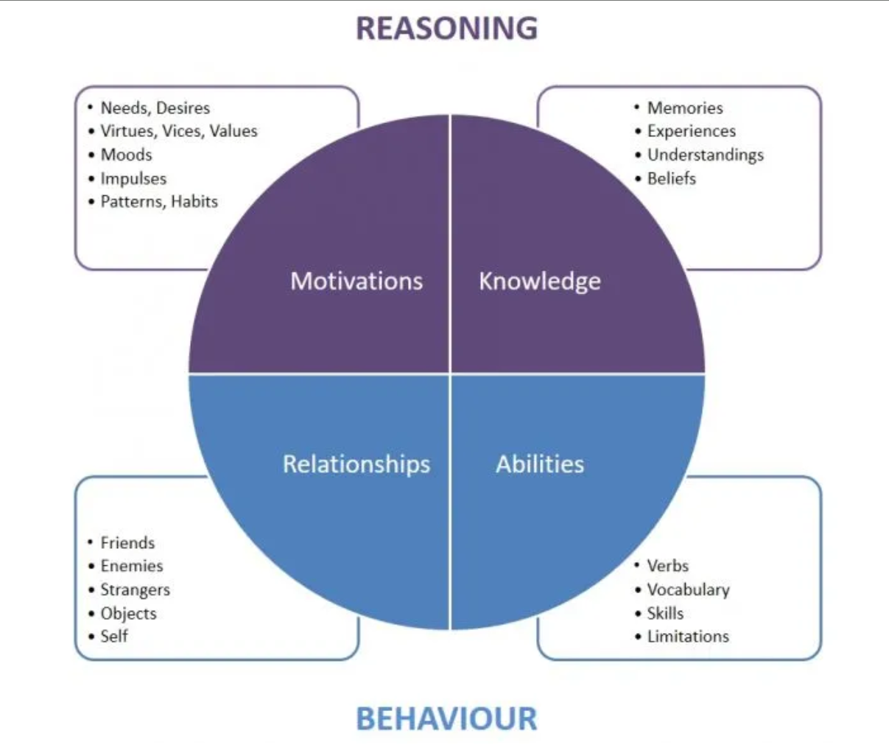

# Персонаж

🦓🛸⌛**Дисклеймер: **материал находится в процессе доработки. Если вы в чем-то несогласны с актуальным материалом — это нормально, мы тоже с ним не во всем согласны. 

**[1] - [10]**

!!! info ""
    *Надежный индикатор вовлеченности аудитории — это уровень ее идентификации с персонажами.*
    *[Скотт Макклауд](https://ru.wikipedia.org/wiki/%D0%9C%D0%B0%D0%BA%D0%BA%D0%BB%D0%B0%D1%83%D0%B4,_%D0%A1%D0%BA%D0%BE%D1%82%D1%82), «[Понимание комикса](https://www.ozon.ru/product/ponimanie-komiksa-138161807/?sh=B5z3GZ2IFw)»*

Помните про основные инструменты нарративного гейм-дизайнера — игровые механики. Настоящее знакомство с персонажами должно происходить через взаимодействие с ними игрока, участие этих персонажей в геймплее, а лучше — через непосредственный контроль над ними со стороны игрока. Посмотрите на [Brothers: A Tale of Two Sons](https://store.steampowered.com/app/225080/Brothers__A_Tale_of_Two_Sons/) — смерть одного из братьев воспринимается как реальная потеря в том числе и потому, что до этого игрок несколько часов комбинировал его действия с действиями другого брата.

## Персонаж игрока
**[11] - [15]**

Старайтесь разделять самого игрока и персонажа игрока. Стреляет в игре **игрок**, но урон получает **персонаж игрока**. Решение принимает игрок и действует тоже игрок, а персонаж — участвует в результате и управляет частью целей игрока. С точки зрения геймплея персонаж в игре — это часть интерфейса: курсор, индикатор, прицел.**[16]** Именно поэтому игроки, за редким исключением, готовы принять практически любого персонажа: игроки понимают, что именно они сами — главные герои игры.

Но воспринимать своего персонажа только интерфейсом было бы слишком скучно, поэтому игроки наделяют их «расширенным функционалом» — воспринимают их как комплекс механик для решения игровых задач (в некоторых играх разные персонажи решают одну и туже задачу по-разному), как инструменты для получения уникальных квестов (например, зависящих от класса или вида героя), как основной центр приложения истории, двигатель сюжета.**[17]**

При этом (и это может показаться странным) **не все игроки отождествляют себя с главным героем игры**.

Это особенности PoV (от англ. point of view — «точка зрения»). Обратите внимание, кто-то говорит: «Выполню квест», а кто-то: «Помогу персонажу выполнить квест». При этом PoV может меняться у одного игрока не только от игры к игре, но и в течение одной игровой сессии.**[18]** На это влияют особенности персонажа (амнезия упрощает адаптацию игрока к характеру персонажа), непосредственно характер (совпал или нет) и поступки (а я бы так поступил?), камера (из глаз или со спины), принцип прямого обращения игры к игроку.**[19]**

В **играх  персонаж игрока — тот, кто действует**, а значит, персонажей может быть одновременно много (например, в партийной RPG**[20]**) и все они будут равны; или же персонажа игрока вообще может не быть в пространстве игры: например, в стратегиях или карточных играх, где персонаж — это сам игрок.

В <u>[Sid Meier's Civilization](https://ru.wikipedia.org/wiki/Civilization_(%D1%81%D0%B5%D1%80%D0%B8%D1%8F))</u>, относящейся к жанру [4X](https://ru.wikipedia.org/wiki/4X) стратегий, построенных вокруг ресурсного и временного менеджмента в пошаговом режиме, игрок не имеет персонажа. Формально он является лидером определенной страны, но по комплексу свойств и доступных действий он ближе к глобальным явлениям на вроде детерминизма или всеобщей причинности. Ну просто потому что ассоциировать себя с государством — довольно тяжело.

К тому же многие игры позволяют игрокам создавать собственных персонажей. Предоставляя игроку подобную возможность, позаботьтесь о том, чтобы он не смог лишить будущего протагониста индивидуальности. Для этого можно просто наделять персонажей группой обязательных черт. Именно для этого в RPG существуют игровые классы — без них игроки склонны создавать однотипных скучных болванчиков.

Отличный пример по использованию индивидуальности персонажей можно найти в [GTA5](https://ru.wikipedia.org/wiki/Grand_Theft_Auto_V). В этой сюжетной open-world action-adventure игроку доступно сразу три персонажа, между которыми он может свободно переключаться:

- Стрелок-тактик Майкл, способный замедлять время во время стрельбы;
- Гонщик-лихач Франклин, умеющий замедлять время во время езды на машине;
- Безумец и отморозок Тревор, впадающий в берсерк.

С точки зрения геймплея эти три персонажа олицетворяют три основных стиля поведения игроков в GTA:

1. Иногда игрокам нужно куда-то пробраться и всех расстрелять;
1. Иногда — угнать машину, уйти от погони или кого-нибудь догнать;
1. Иногда игрокам просто все надоедает и они начинают буйствовать, убивая прохожих, взрывая машины и отбиваясь от полиции.

Во всех сериях GTA игроки всегда поочередно навешивали на себя эти три основных роли/маски. Разработчики, увидев это, просто дали игрокам возможность делать то, что они и так делают, но введя для этого персонажей-роли с соответствующим нарративом.

## Неигровые персонажи
**[22] - [23]**

[Неигровые персонажи](https://ru.wikipedia.org/wiki/%D0%9D%D0%B5%D0%B8%D0%B3%D1%80%D0%BE%D0%B2%D0%BE%D0%B9_%D0%BF%D0%B5%D1%80%D1%81%D0%BE%D0%BD%D0%B0%D0%B6) (Non-Player Character, NPC) — т. е. **персонажи, управляемые в компьютерных играх не игроком, а компьютером**, часто требуют от разработчиков куда больше внимания, чем персонаж игрока.

Ведь персонаж игрока — это «вход» в самого игрока, его отражение в мире игры, а себя игрок и так знает и не всегда готов меняться по прихоти разработчиков. А вот неигровые персонажи — это «вход» в социальный мир игры.

Наша способность мысленно наделять живыми чертами неживые объекты позволяет нам свободно коммуницировать с компьютерными персонажами, даже если они всего лишь иконки в панели интерфейса. Пока мы играем с ними в игру — мы воспринимаем их живыми.

И поэтому неигровые персонажи — это, по сути, цели, задачи и мотивация игрока. Именно ради них мы выполняем квесты. Часто, ориентируясь именно на особенности NPC, а не на собственного персонажа, мы делаем тот или иной сюжетный выбор.

## Советы
**[24]**

Придумывая персонажа (особенно неигрового), отобразите особенности геймплея в его нарративе.

Если вам нужно создать систему архетипов неигровых персонажей — попробуйте построить набор архетипов от игровых механик; если у вас в игре есть боевка, крафт, строительство — не забудьте создать игровых персонажей, олицетворяющих эти механики. Кажется, похожий совет уже проскакивал в одном из первых уроков.

Создавая персонажа:

- Отвечайте на вопрос, почему он такой — почему злой, почему сильный, почему глупый;
- Ищите его главный мотив;
- Не забудьте добавить противоречивости и убрать обыденность.

Попробуйте описать вашего NPC по следующей схеме:**[25]** 

- Имя, желательно говорящее
- Кредо, отражающее характер
- Прошлое
- Становление
- Мотивация
- Особенности
- Сеттинговая составляющая
- Жанровая составляющая
- “Приземление” на игровые механики

Проработайте первую встречу игрока и персонажа, заставьте персонажа действовать на благо или во вред герою, выдайте ему речевую характеристику, продумайте его сюжетную арку и начните её разворачивать хотя бы просто в диалогах с игроком.

И тогда история персонажа, его особенности, глубина и фактурность родятся сами собой.

Можете также прочесть «[Краткое руководство по умным персонажам](https://lesswrong.ru/w/%D0%A1%D0%BE%D0%BA%D1%80%D0%B0%D1%89%D0%B5%D0%BD%D0%BD%D0%BE%D0%B5_%D1%80%D1%83%D0%BA%D0%BE%D0%B2%D0%BE%D0%B4%D1%81%D1%82%D0%B2%D0%BE_%D0%BF%D0%BE_%D1%83%D0%BC%D0%BD%D1%8B%D0%BC_%D0%BF%D0%B5%D1%80%D1%81%D0%BE%D0%BD%D0%B0%D0%B6%D0%B0%D0%BC)» от автора фанфика «[Гарри Поттер и методы рационального мышления](https://ru.wikipedia.org/wiki/%D0%93%D0%B0%D1%80%D1%80%D0%B8_%D0%9F%D0%BE%D1%82%D1%82%D0%B5%D1%80_%D0%B8_%D0%BC%D0%B5%D1%82%D0%BE%D0%B4%D1%8B_%D1%80%D0%B0%D1%86%D0%B8%D0%BE%D0%BD%D0%B0%D0%BB%D1%8C%D0%BD%D0%BE%D0%B3%D0%BE_%D0%BC%D1%8B%D1%88%D0%BB%D0%B5%D0%BD%D0%B8%D1%8F)» [Элиезера Юдковского](https://ru.wikipedia.org/wiki/%D0%AE%D0%B4%D0%BA%D0%BE%D0%B2%D1%81%D0%BA%D0%B8%D0%B9,_%D0%AD%D0%BB%D0%B8%D0%B5%D0%B7%D0%B5%D1%80). Хотя мне куда больше по нраву [умные персонажи](https://mother-of-learning.fandom.com/wiki/Mother_of_Learning_Wiki) [nobody103](https://fantlab.ru/autor109440). 

----

В статье [Maximizing the Impact of Generated Personalities](https://www.gamedeveloper.com/design/maximizing-the-impact-of-procedural-personalities) [Тани Шорт](https://en.wikipedia.org/wiki/Tanya_X._Short) есть интересная диаграмма:

Я крайне рекомендую вам внимательно прочесть статью. Используя данную модель, вы сможете параметризировать и описывать нарративную составляющую персонажей в своей игре.

Еще в работе с персонажами можно попробовать воспользоваться [таблицей Мейерхольда](http://posmotreli.su/index.php/%D0%A2%D0%B0%D0%B1%D0%BB%D0%B8%D1%86%D0%B0_%D0%9C%D0%B5%D0%B9%D0%B5%D1%80%D1%85%D0%BE%D0%BB%D1%8C%D0%B4%D0%B0), тем более она ориентирована на театры, где активно действует не только главный герой, но и другие участники сцены. Таким образом, данная система амплуа может относительно хорошо подойти при разработке партийной RPG или Squad Level Tactics.
