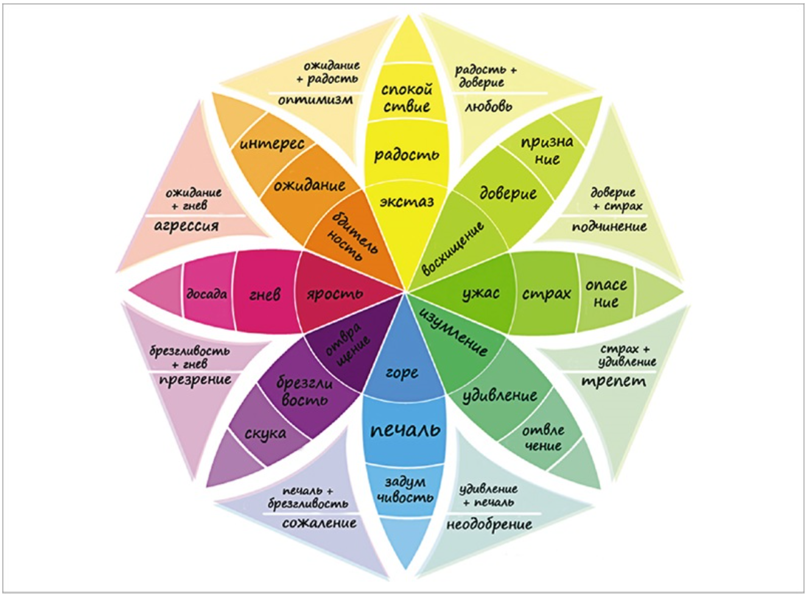
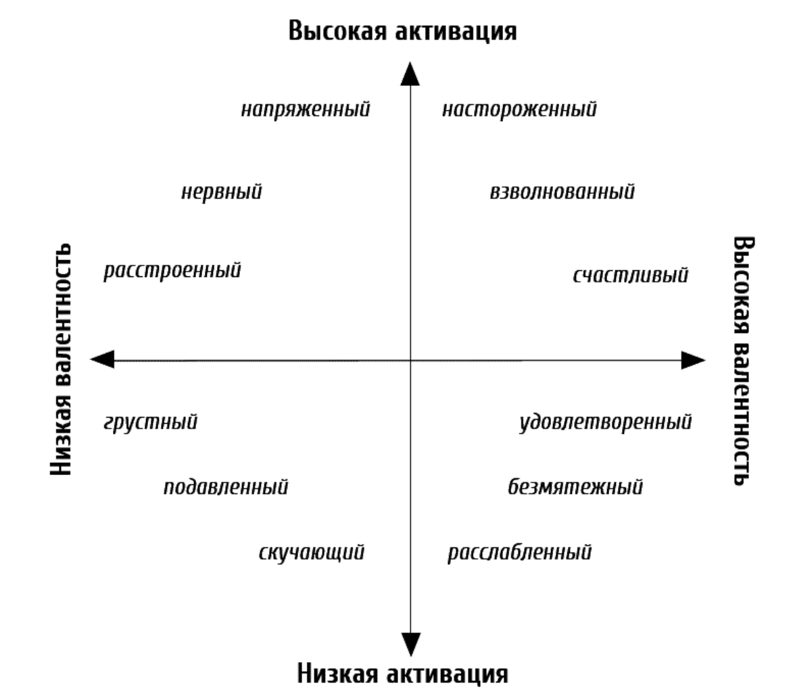
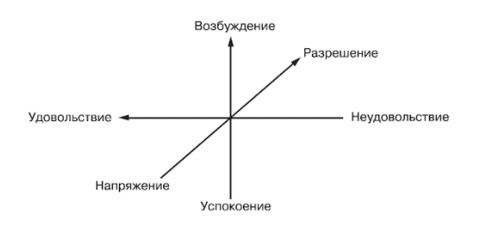
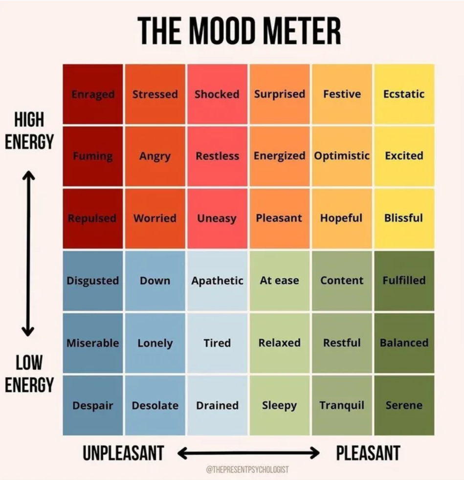
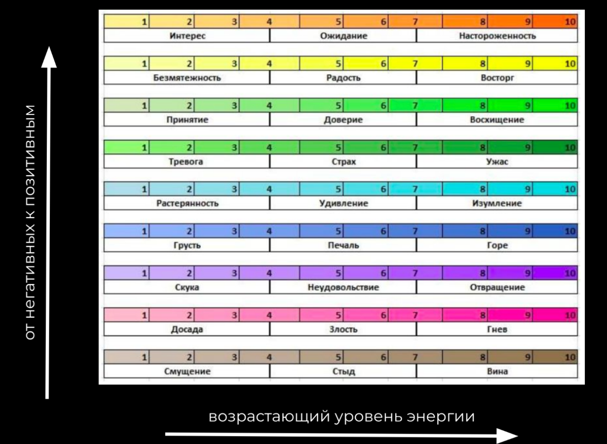

# Классификация эмоций

🦓🛸⌛**Дисклеймер: **материал находится в процессе доработки. Если вы в чем-то несогласны с актуальным материалом — это нормально, мы тоже с ним не во всем согласны.

Всегда полезно выделить главный набор эмоций, которые должен испытывать игрок, и максимально поддерживать эти эмоции всеми имеющимися игровыми механиками.

Здесь разработчики обычно сталкиваются проблемой формирования единого списка эмоций, доступных человеку.

Начать можно с изучения уже довольно устаревшей [теории](https://psychojournal.ru/article/145-adaptacionnaya-teoriya-emociy-roberta-plutchika.html) [Роберта Плутчика](https://en.wikipedia.org/wiki/Robert_Plutchik) и его колеса эмоций:

[Ссылка на еще одну схему](https://2.bp.blogspot.com/-4U0hcKjQITY/W-9ojEUjFgI/AAAAAAAAcvw/6Ju9tJwcsrIg6BYZkfncSDyQEN7MpVrWQCLcBGAs/s1600/3-PDGAs-D-U.jpg), где наименования эмоций переведены чуть иначе.
Плутчик спорный: кажется, он ничего не знает о нейромедиаторах. Поэтому можно попробовать обратиться к работам [К. Э. Изарда](https://ru.wikipedia.org/wiki/%D0%98%D0%B7%D0%B0%D1%80%D0%B4,_%D0%9A%D1%8D%D1%80%D1%80%D0%BE%D0%BB), в рамках которых принято выделять следующие [базовые эмоции](https://ru.wikipedia.org/wiki/%D0%AD%D0%BC%D0%BE%D1%86%D0%B8%D0%BE%D0%BD%D0%B0%D0%BB%D1%8C%D0%BD%D1%8B%D0%B9_%D0%BF%D1%80%D0%BE%D1%86%D0%B5%D1%81%D1%81#%D0%91%D0%B0%D0%B7%D0%BE%D0%B2%D1%8B%D0%B5_%D1%8D%D0%BC%D0%BE%D1%86%D0%B8%D0%B8):

1. Интерес — возбуждение
1. Удовольствие — радость
1. Удивление — любопытство (?)
1. Горе — страдание
1. Гнев — ярость
1. Отвращение — омерзение
1. Презрение — пренебрежение
1. Страх — ужас
1. Стыд — застенчивость
1. Вина — раскаяние

Что именно считать **базовыми эмоциями** (т. е. в определенном виде заложенными в нас изначально) и есть ли они вообще — до сих пор является предметом научного спора. [В этой статье](https://psychologos.ru/articles/view/bazovye-emocii-po-izardu) вы можете прочесть о критериях, по которым принято определять базовые эмоции. Но, обратите внимание, 11-й выделяемой Изардом эмоцией в статье указано «смущение», что не совпадает с данными в Википедии.

Эмоции вроде как нужно отделять от чувств. Так, «смущение» и «удивление» иногда относят к чувствам, а не к эмоциям. А «интерес» —  это, возможно, не столько эмоция, сколько формирование потребности в эмоции. В современных гуманитарных «науках» та еще каша, а естественные науки сюда еще не скоро доберутся.

Помимо непосредственно эмоций и их очевидной различной интенсивности, принято выделять так называемую [эмоциональную валентность](https://ru.wikipedia.org/wiki/%D0%92%D0%B0%D0%BB%D0%B5%D0%BD%D1%82%D0%BD%D0%BE%D1%81%D1%82%D1%8C_(%D0%BF%D1%81%D0%B8%D1%85%D0%BE%D0%BB%D0%BE%D0%B3%D0%B8%D1%8F)) (привлекательность для переживающего эмоцию):

Т. е. быть счастливым предпочтительнее, чем грустным (кто бы мог подумать), но настороженным — предпочтительнее, чем скучающим. На картинке выше — так называемся двухмерная (круговая) модель эмоций [Джеймса Рассела](https://ru.wikibrief.org/wiki/James_A._Russell). При этом более чем за 100 лет до Рассела другой психолог — [Вильгельм Вундт](https://ru.wikipedia.org/wiki/%D0%92%D1%83%D0%BD%D0%B4%D1%82,_%D0%92%D0%B8%D0%BB%D1%8C%D0%B3%D0%B5%D0%BB%D1%8C%D0%BC) — предложил [трехмерную модель оценки эмоциональных состояний](https://psy.wikireading.ru/hRWqen8iY1):

Еще один интересный этап в истории исследований эмоций — это [двухфакторная теория эмоций](https://ru.wikipedia.org/wiki/%D0%94%D0%B2%D1%83%D1%85%D1%84%D0%B0%D0%BA%D1%82%D0%BE%D1%80%D0%BD%D0%B0%D1%8F_%D1%82%D0%B5%D0%BE%D1%80%D0%B8%D1%8F_%D1%8D%D0%BC%D0%BE%D1%86%D0%B8%D0%B9), которая гласит, что **никаких различных эмоций нет**. Эта теория утверждает, что сами по себе эмоции — не более чем когнитивная интерпретация человеком своего физиологического возбуждения. Т. е. если мы гиперактивны, а контекст ситуации позитивен — мы испытываем радость, а если негативен — то грусть. Данная теория уже частично опровергнута, но я бы крайне рекомендовал ее изучить — наводит на некоторые интересные размышления.

Если же вам требуется совсем-совсем простой подход к набору эмоций, можно ограничиться теми, которыми сейчас [обучают андроидов](https://www.riken.jp/en/news_pubs/research_news/pr/2022/20220210_1/index.html):

1. Счастье
1. Печаль
1. Страх
1. Гнев
1. Удивление
1. Отвращение

Считается, что именно эти 6 эмоций наиболее эффективно распознаются людьми.

_

Еще парочка диаграмм с эмоциями:

