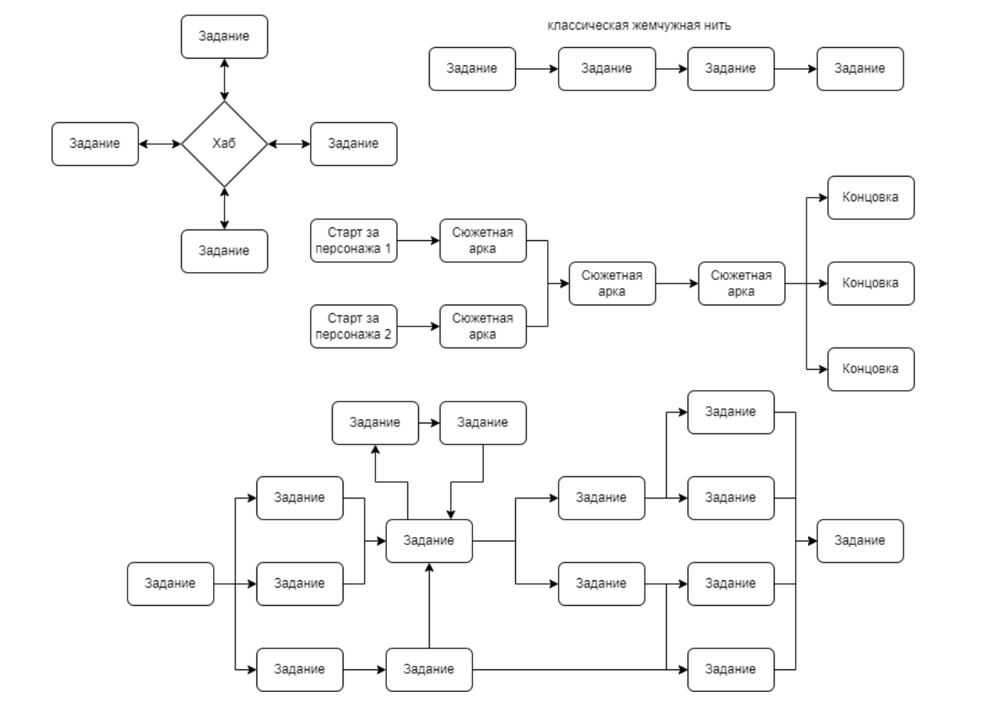

# Встроенное повествование

🦓🛸⌛**Дисклеймер: **материал находится в процессе доработки. Если вы в чем-то несогласны с актуальным материалом — это нормально, мы тоже с ним не во всем согласны. 

**[1][2]**

В классическом понимании встроенный принцип повествования позаимствован из фильмов, книг и комиксов. При этом совершенно не обязательно, чтобы история рассказывалась классическими методами, через катсцены или текст — есть множество компьютерных игр, в которых история рассказывается практически без текста и роликов: например, [Brothers: A Tale of Two Sons](https://store.steampowered.com/app/225080/Brothers__A_Tale_of_Two_Sons/?l=russian).

В ультимативном варианте это линейное развитие заранее заскриптованного сюжета: игрок переходит от сцены к сцене, от локации к локации, и постепенно узнает историю, заранее размещенную разработчиками в игре. На каждой локации у игрока есть некоторая свобода действий, которая, впрочем, может ограничиваться только последовательностью уничтожения врагов и выбором оружия, которым он их уничтожает. При повторном прохождении все повторится, отличаясь зависящими от игрока таймингами событий и, возможно, нюансами поведения игрока, но ключевые этапы и результаты останутся теми же.

*Появиться, пройти 10 комнат и убить 100 демонов, найти ключ, пройти еще 10 комнат и убить еще 100 демонов, открыть ключом дверь, убить босса...Повторить.*

Или, если вам не нравится пример из [экшенов](https://ru.wikipedia.org/wiki/Action), вот вам классический сюжетный [квест](https://ru.wikipedia.org/wiki/%D0%9F%D1%80%D0%B8%D0%BA%D0%BB%D1%8E%D1%87%D0%B5%D0%BD%D1%87%D0%B5%D1%81%D0%BA%D0%B0%D1%8F_%D0%B8%D0%B3%D1%80%D0%B0):

*Поговорить с [NPC](https://ru.wikipedia.org/wiki/%D0%9D%D0%B5%D0%B8%D0%B3%D1%80%D0%BE%D0%B2%D0%BE%D0%B9_%D0%BF%D0%B5%D1%80%D1%81%D0%BE%D0%BD%D0%B0%D0%B6), получить от него предмет, применить его на ранее найденный и в результате получить новый, поговорить с другим NPC и отдать ему новый предмет, за что получить ключ, который откроет дверь, за которым будет новый NPC…*

Такие игры, как [Gardenscapes](https://play.google.com/store/apps/details?id=com.playrix.gardenscapes&hl=ru&gl=US), [Limbo](https://ru.wikipedia.org/wiki/Limbo_(%D0%B8%D0%B3%D1%80%D0%B0)) — это все примеры превалирующего встроенного повествования.

В [Dragon Age](https://store.steampowered.com/app/17450/Dragon_Age_Origins/) больше встроенного повествования — вся история со всеми развилками готова заранее, и если игрок не будет по ней продвигаться — мир игры застынет на месте. Однако есть сюжетные вилки, позволяющие игроку собрать свою историю из предложенных вариантов, а прокачка и «сюжеты боевки» содержат большой элемент независимости.

Иногда наличие встроенного повествования является маркером story-driven подхода (так называемая «история-история») — когда **игру разрабатывают от истории** и игровые механики выстраиваются уже вокруг сюжета, персонажей и сеттинга. Но это не всегда связанные вещи: многие «тупые» [аркады](https://ru.wikipedia.org/wiki/%D0%90%D1%80%D0%BA%D0%B0%D0%B4%D0%B0_(%D0%B6%D0%B0%D0%BD%D1%80)) имеют ярко выраженное встроенное повествование, при этом внятная история была добавлена в них в последний момент.

Как с этим работать нарративному дизайнеру: иногда у нас есть хорошая история или интересный персонаж, мы уже знаем, что с точки зрения нарратива будет происходить в игре, и теперь зовем дизайнеров механик, чтобы они придумали, «**как это будет происходить**». Например, мы хотим рассказать о том, каково это — быть сыщиком, убийцей монстров или, не дай бог, что значит пережить смерть собственного ребенка от рака ([That Dragon](https://store.steampowered.com/app/419460/That_Dragon_Cancer/?l=russian), [Cancer](https://store.steampowered.com/app/419460/That_Dragon_Cancer/?l=russian)). Гейм-дизайнеры приносят механики, способные раскрыть игроку диктуемый нарративом опыт, а нарративный дизайнер следит, чтобы механики не разрушили нарратив.

Обратите внимание, так называемые [immersive sim](https://ru.wikipedia.org/wiki/Immersive_sim) — это встроенное повествование, просто содержащее несколько вариантов прохождения.

При этом принципы, по которым формируется встроенное повествование, могут сильно отличаться. Например, это может быть как классическая жемчужная нить, так и более сложные конструкции:

На самом деле способов значительно больше.

Например, можно выделить ветвление с состоянием.**[3]**

## Советы
----

Помните: у всех заранее прописанных вариативных систем есть общая проблема — [комбинаторный взрыв](https://ifwiki.ru/%D0%9A%D0%BE%D0%BC%D0%B1%D0%B8%D0%BD%D0%B0%D1%82%D0%BE%D1%80%D0%BD%D1%8B%D0%B9_%D0%B2%D0%B7%D1%80%D1%8B%D0%B2). Грубо говоря, это когда добавление нового варианта развития событий так сильно усложняет дальнейшую разработку сюжета, что на нарративный дизайн перестают выделять требуемый бюджет.

----

Краткий конспект перевода ([progamer.ru](https://www.progamer.ru/dev/beyond-branching.htm)) статьи [Эмили Шорт](https://ifwiki.ru/%D0%A8%D0%BE%D1%80%D1%82,_%D0%AD%D0%BC%D0%B8%D0%BB%D0%B8) «[Три вида повествовательных структур в качестве альтернативы ветвлению](https://ifwiki.ru/%D0%A2%D1%80%D0%B8_%D0%B2%D0%B8%D0%B4%D0%B0_%D0%BF%D0%BE%D0%B2%D0%B5%D1%81%D1%82%D0%B2%D0%BE%D0%B2%D0%B0%D1%82%D0%B5%D0%BB%D1%8C%D0%BD%D1%8B%D1%85_%D1%81%D1%82%D1%80%D1%83%D0%BA%D1%82%D1%83%D1%80_%D0%B2_%D0%BA%D0%B0%D1%87%D0%B5%D1%81%D1%82%D0%B2%D0%B5_%D0%B0%D0%BB%D1%8C%D1%82%D0%B5%D1%80%D0%BD%D0%B0%D1%82%D0%B8%D0%B2%D1%8B_%D0%B2%D0%B5%D1%82%D0%B2%D0%BB%D0%B5%D0%BD%D0%B8%D1%8E)», в которой рассматриваются иные способы построения встроенного повествования:

«Нелинейное повествование с неким влиянием игрока на исход событий» возможно не только через «ветвящееся повествование».

Моя история состоит из отдельных фрагментов. Как мне выбрать, какой фрагмент показывать игроку следующим?

**Повествование на основе качеств** (quality-based narrative, QBN) – этот термин введен Failbetter Games ([Fallen London](https://en.wikipedia.org/wiki/Fallen_London)) для обозначения интерактивных историй, завязанных на «**сторилетах**», открывающихся посредством качеств.

Сторилет – это один-два абзаца текста с последующим выбором и текстовым описанием результата выбора. Качества – это числовые переменные, которые могут расти или сокращаться по ходу игры — по сути, это ресурсы и/или характеристики. Наличие качества нужного значения дает доступ к столрилету. При этом, будучи выполненным, сторилет может изменить это или какое-то другое качество.

Некоторые сторилеты требуют ресурсов, которые надо раздобыть где-то в другом месте, но получение и использование ресурсов зачастую отдается на откуп игроку, так что вы можете и не удержать в голове причинно-следственную связь. С другой стороны, причины и следствия могут соединиться в привлекательную цепь: сторилет требует определенного ресурса, вы знаете, где его можно достать, идете за ним, возвращаетесь и получаете целый побочный квест, вплетенный в историю, которая могла бы развернуться и без него.

**Повествование на основе совпадений** — истории, где небольшая часть контента выбирается из большой массы в зависимости от того, какой элемент считается наиболее подходящим в конкретный момент. Смотрим на набор условий и выбираем то, что этому набору наиболее соответствует. Простейший пример: диалоговая система Элана Раскина (Elan Ruskin) из [Left 4 Dead](https://ru.wikipedia.org/wiki/Left_4_Dead), когда ИИ-персонаж видит аптечку и говорит: «Тут аптечка».

**Повествование с путевыми точками** — когда не только игрок, но и сама игра могут выбирать направление дальнейшего развития событий, сопротивляясь выборам друг друга и ища ситуации, в которых выбор может быть только в их пользу. **[4]**
