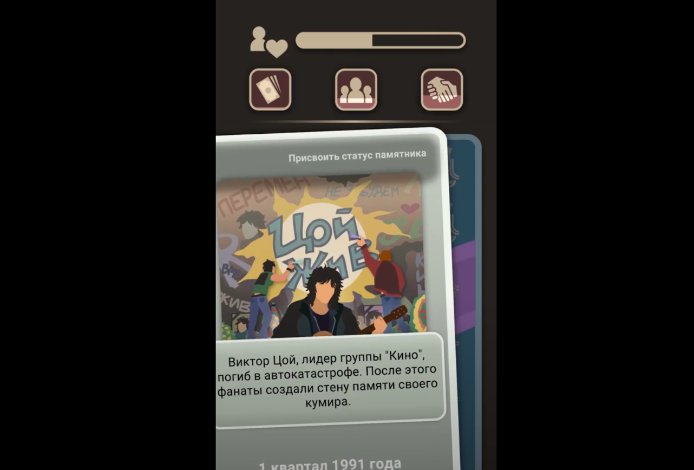

# Повествование через окружение

🦓🛸⌛**Дисклеймер: **материал находится в процессе доработки. Если вы в чем-то несогласны с актуальным материалом — это нормально, мы тоже с ним не во всем согласны. 

**[1]-[3]**

Или environmental storytelling**[4]** — повествование через окружение и левел-дизайн.

Начну с рекомендации главы «[Сюжет посредством игрового окружения](http://level-design.ru/pro-ld-book-index/04-environmental-storytelling/)» из книги «[Проектирование виртуальных миров](http://level-design.ru/pro-ld-book-index/)» за авторством левел-дизайнера [Михаила Кадикова](http://level-design.ru/about/) ([Hunt: Showdown](https://store.steampowered.com/app/594650/Hunt_Showdown/), [Might & Magic Heroes VII](https://store.steampowered.com/app/321960/Might__Magic_Heroes_VII/?l=russian)).

Очень важно понимать, что окружение — это не только 2D/3D-сцена в мире игры. Левел-дизайн присутствует во всех играх, ведь игровое пространство есть даже в текстовых квестах. Обычный диалоговый экран в текстовой игре — это уже локация, даже если ничего, кроме букв, на ней не отображается.

Например, картинка на карточке в игре типа [The 90s](https://play.google.com/store/apps/details?id=com.ithub.The90s&hl=ru) — это полноценный игровой уровень, с которым нужно работать, как если бы по нему мог бегать игрок; главное учитывать, что вместо персонажа-курсора там будет перемещаться фокус внимания игрока:

Всегда помните, что ассоциации первого уровня — это моветон, работайте с фантазией игрока, используйте иносказательность. Картинка не должна буквально изображать текст, а текст — буквально описывать картинку. Если игроку потребовалось хотя бы на секунду задуматься, чтобы соотнести изображение и надпись (понять, что от него хочет игра, найти скрытый смысл), — значит, он принимал решение, фактически — играл. Обратите внимание: когда соотнесение картинки с текстом для игрока превышает определенное критическое время, нарративный процесс превращается в самостоятельную игровую механику — [пазл](https://ru.wikipedia.org/wiki/%D0%9F%D0%B0%D0%B7%D0%BB), загадку.

Если вы начнете думать о любом экране игры как об игровом пространстве — вам станет легче понимать, как в него можно заложить нарратив. 

Если же говорить о «больших играх», тех, где игроки управляют трехмерными персонажами, бегающими по трехмерным локациям, — разделяйте левел-дизайн и левел-арт. 

Большинство игроков думает, что левел-дизайн — это расстановка по уровню растений, обустройство внутреннего интерьера зданий, помещение на небо солнца и облаков. Но настоящий **левел-дизайн** — это создание геометрии уровня, в которой игрок будет ощущать себя как в интересном лабиринте обусловленной геймплеем сложности. Если вы посмотрите на обычные помещения в хороших играх, вы увидите, что и там есть простейшие лабиринты: пространство преграждают стулья, столы, бочки, другие препятствия. Потому что это скучно — ходить по прямой.

Опытные **левел-дизайнеры** сначала собирают локацию или игровой уровень из примитивов (иногда их называют graybox или whitebox — все зависит от редактора, который используют разработчики), а уже потом передают уровень левел-артистам, которые обставляют его моделями «реальных» объектов с учетом геометрии примитивов.

**Левел-артисты** куда больше художники, чем гейм-дизайнеры, так что им часто может потребоваться помощь нарративного дизайнера для правильного оформления сцен, расстановки акцентов (целеполагания, индикации), для следования игровому сеттингу.
