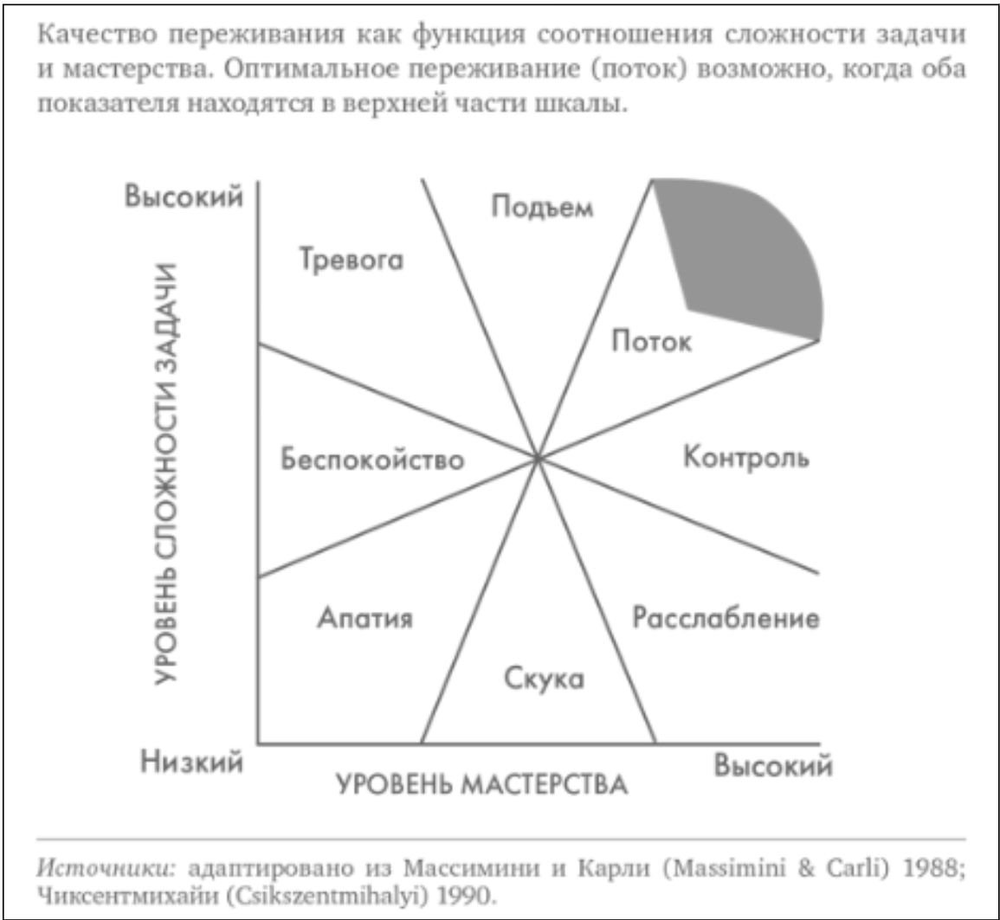
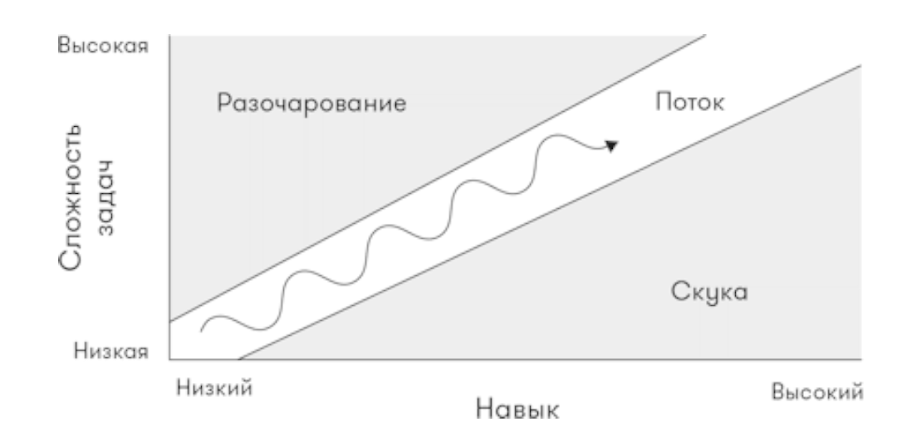

# Состояние потока

🦓🛸⌛**Дисклеймер: **материал находится в процессе доработки. Если вы в чем-то несогласны с актуальным материалом — это нормально, мы тоже с ним не во всем согласны. 

**[1]-[6]**

Вы будете часто слышать о [состоянии потока (flow)](https://ru.wikipedia.org/wiki/%D0%9F%D0%BE%D1%82%D0%BE%D0%BA_(%D0%BF%D1%81%D0%B8%D1%85%D0%BE%D0%BB%D0%BE%D0%B3%D0%B8%D1%8F)), если пойдете по пути разработчика игр. **[7]**

Автор данной концепции, психолог [Михай Чиксентмихайи](https://ru.wikipedia.org/wiki/%D0%A7%D0%B8%D0%BA%D1%81%D0%B5%D0%BD%D1%82%D0%BC%D0%B8%D1%85%D0%B0%D0%B9%D0%B8,_%D0%9C%D0%B8%D1%85%D0%B0%D0%B9), характеризует состояние потока как **«чувство полной фокусировки на определенном действии, которое сопровождается высоким уровнем наслаждения и удовлетворенности»**.

Следует оговориться, что применительно к играм состояние потока [начал рассматривать](https://drive.google.com/file/d/1BFFGw73FWrSFkL_dLwBM-_w-CLeDw_U8/view) не Чиксентмихайи, а китайский гейм-дизайнер [Дженова Чэнь](https://ru.wikipedia.org/wiki/%D0%94%D0%B6%D0%B5%D0%BD%D0%BE%D0%B2%D0%B0_%D0%A7%D1%8D%D0%BD%D1%8C) — автор небезызвестной [Journey](https://ru.wikipedia.org/wiki/Journey_(%D0%B8%D0%B3%D1%80%D0%B0,_2012)).

В качестве признаков потока обычно называют следующие:

- Полная концентрация и фокус внимания на процессе;
- Потеря чувства самоосознания — слияние действия и осознанности:
    - когда игрок перестает осознавать себя, вести отвлеченный внутренний диалог, и ощущает только действия, которые совершает.
- Искаженное восприятие времени;
- Ощущение полного контроля над ситуацией или деятельностью;
- Деятельность сама по себе воспринимается как награда.

В качестве условий возникновение потока Чиксентмихайи отмечает:

- **Ясные цели, условия и задачи:**
    - Полностью известные и четкие правила;
    - Понятная и реалистичная задача;
    - Уверенное понимание способов достижения и программы действий;
    - Достаточная степень предвидения результатов;
    - Соответствие между конкретными задачами и более абстрактными долгосрочными целями.
- **Отсутствие отвлекающих факторов:**
    - Отсутствие внешних раздражителей;
    - Отсутствие посторонних целей;
    - Моментальное возобновление процесса (короткий цикл).
- **Прямая и незамедлительная обратная связь:** **[8]**
    - Моментальное понимание приближения к цели;
    - Понятность возможности и причин ошибки.
- **Баланс навыков игрока и сложности задачи.**

Помните, как в [сказке Катаева](https://ru.wikipedia.org/wiki/%D0%94%D1%83%D0%B4%D0%BE%D1%87%D0%BA%D0%B0_%D0%B8_%D0%BA%D1%83%D0%B2%D1%88%D0%B8%D0%BD%D1%87%D0%B8%D0%BA):

>*Одну ягодку беру,*
>*На другую смотрю,*
>*Третью примечаю,*
>*А четвертая мерещится.*

Возникает спорный вопрос, какой длительностью может обладать состояние потока.

Честно говоря, я долгое время считал, что это состояние занимает секунды, ну, может быть, минуты. Но сейчас все больше склоняюсь к точке зрения, что оно может длиться часами, а иногда и целыми днями — например, когда вы в потоке планомерно зачищаете [карту очень понравившейся вам игры от маркеров квестов](https://gamesisart.ru/images/screens/Witcher_3/Map_Velen.jpg).

Однако плотность и эффективность такого длительного потока остается под вопросом.

Есть мнение (возможно, пока оно только мое), что состояние потока — это то, что в нарративном дизайне иногда еще называют **вовлечением**. И в дальнейшем я буду использовать термины **«поток»** и **«вовлечение»** в качестве синонимов.

**Вовлечение (Engagement) [9] — желание продолжать делать то, что вы уже делаете**, в нашем случае — **поддерживать игровой процесс**. Это вовлеченность в процесс игры, буквально — мануальное и ментальное удовольствие от деятельности, вовлеченность в поток интерактивного взаимодействия.

Вовлечение требует активных действий со стороны игрока — нажатий на кнопки, обдумывания стратегий и прогнозирования возможных результатов.

Читая книгу или смотря фильм, вы тоже принимаете решения, требуете от персонажей предполагаемых вами действий, внутренне реагируете на происходящее: «Запри дверь!», «Скажи ему это!», «Да что вообще происходит?!»; гадаете, кто убийца, даже можете на секунду представить себя в роли идущего по следу детектива.

Но это чувство мимолетно и всецело отдано на откуп вашей фантазии, тогда как в играх вы действительно детектив, вы действительно разгадываете загадку. И нельзя просто перевернуть десяток страниц и узнать, кто совершил преступление — без усилий с вашей стороны разгадка не появится на свет. Вы не просто присутствуете, вы вовлечены в поток.

И если совсем упростить понятие состояния потока, то можно сказать, что **поток — это когда время в игре проходит незаметно**.

**Совет!**

!!! info ""
    Здесь можно еще немного почитать про поток: <u>[1 часть статьи](http://empathybox.me/ru/archives/1595)</u>, <u>[2 часть статьи](http://empathybox.me/ru/archives/1652)</u>.

**Совет!**

!!! info ""
    Совет из книги <u>[Гейм-дизайн](https://www.ozon.ru/product/geymdizayn-retsepty-uspeha-luchshih-kompyuternyh-igr-ot-super-mario-i-doom-do-assassin-s-creed-174491284/?sh=sLpb0y8o)</u> <u>[Тайнана Сильвестра](https://tynansylvester.com/about/)</u>:
    
    *Чтобы создать опыт, который отражает опыт персонажа, мы создаем его из трех частей~:*
    
    *1. Во-первых, создаем **поток**, чтобы «изъять» реальный мир из головы игрока;
    2. Во-вторых, создаем состояние возбуждения, используя в игровой механике угрозы и трудности;
    3. Наконец, добавляем сюжет, чтобы создать возбуждение игрока, которое будет соответствовать чувствам персонажа.*
    
    Думаю, все дело в том, что наше сознание непрерывно объясняет нам происходящее вокруг, происходящее с нами, а также причины наших собственных действий.
    
    Если то, что происходит, то, что от нас хотят, и то, что мы делаем, совпадает с нашими объяснениями/пониманием — мы в потоке и с максимальным эффектом присутствия. Если нет — нас «выбивает из реальности».
    
    Мне кажется, это верно как для компьютерных игр, так и для нашей жизни вообще.
