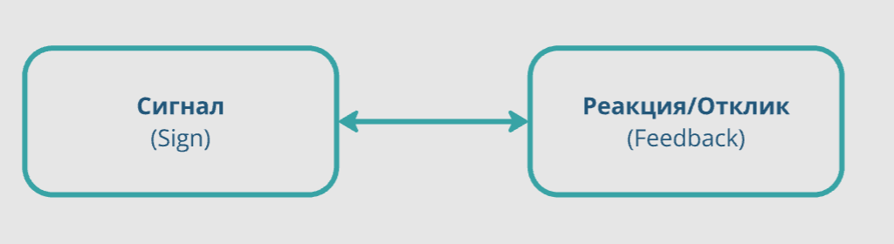
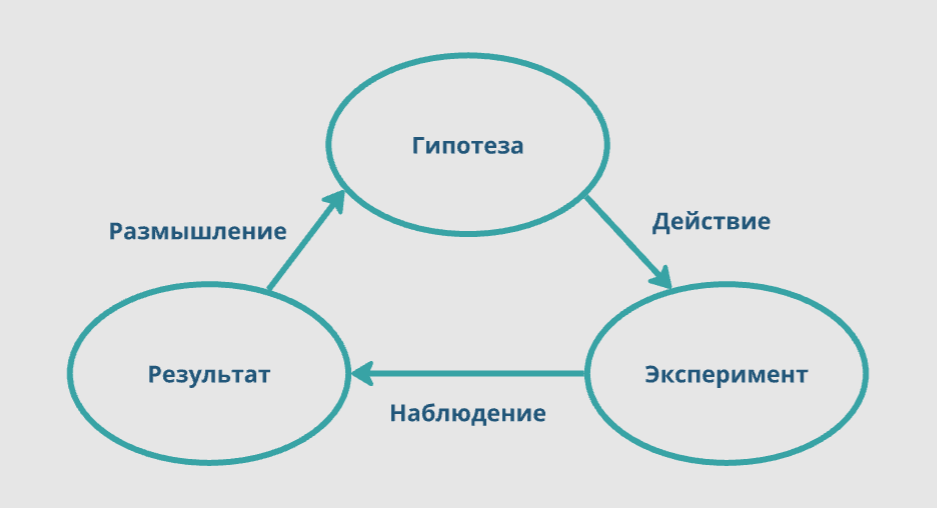
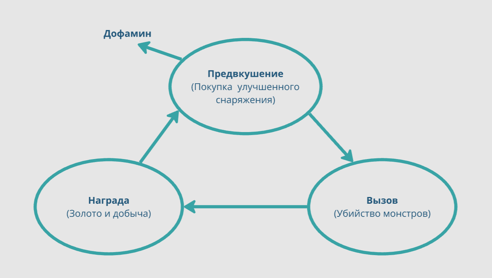
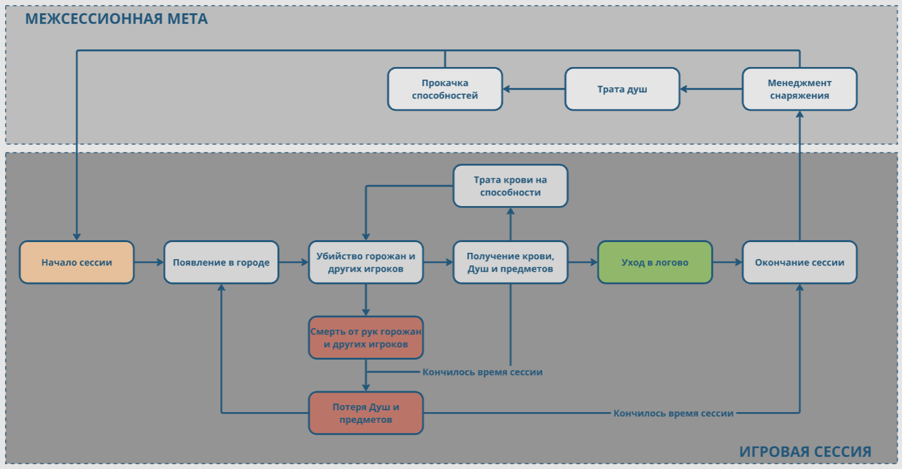
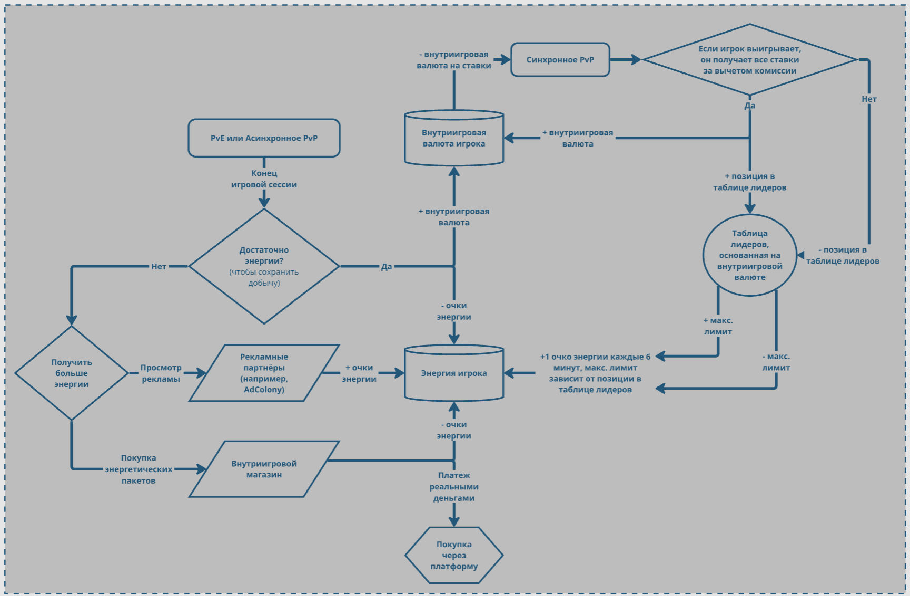
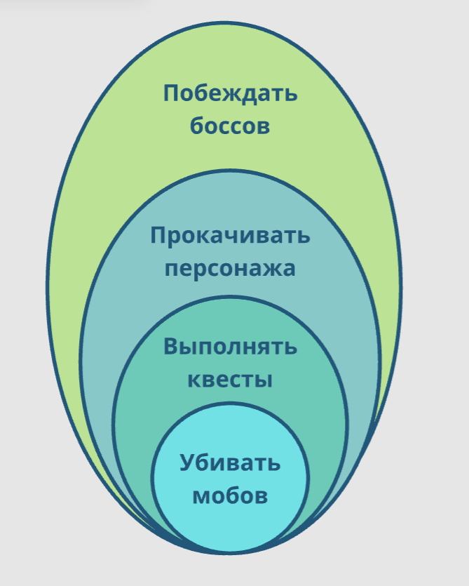
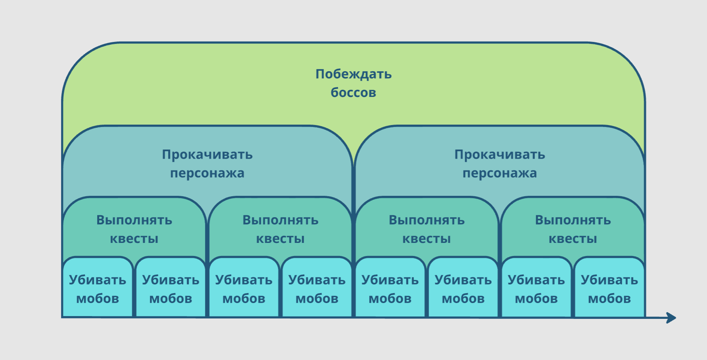

# Игровые циклы

🦓🛸⌛**Дисклеймер: **материал находится в процессе доработки. Если вы в чем-то несогласны с актуальным материалом — это нормально, мы тоже с ним не во всем согласны.

**[1]-[6]**

Вы заметили, что большинство игровых целей возвращается к игроку вновь и вновь — убей монстра, получи новый уровень, выполни квест? **[7]**

Это проявление так называемых **игровых (геймплейных) циклов** — результата комбинирования целеполагания с игровыми механиками.

## Циклы в игре
**[8]-[9]**

----

[Игровой цикл](https://ru.wikipedia.org/wiki/%D0%98%D0%B3%D1%80%D0%BE%D0%B2%D0%BE%D0%B9_%D1%86%D0%B8%D0%BA%D0%BB) (англ. gameplay loop, геймплейные циклы, циклы геймплея) — **повторяемая последовательность взаимосвязанных элементов игрового процесса**, ключевой элемент игровой механики, который определяет фундаментальный опыт игрока. **Один минимальный игровой цикл представляет собой действие игрока, результат этого действия в игровом мире, реакцию игрока на результат и запрос игры на повторение нового действия**.

Если совсем просто, то:

На экране что-то произошло — игрок отреагировал, игрок что-то сделал — на экране что-то произошло.

Википедия предлагает на этот счет более сложную модель:

...но это, по сути, просто детализация предыдущей.

**Все игры состоят из постоянно повторяющихся циклов.**

В футболе игроки ведут мяч, отбирают его друг у друга, пасуют, бьют по воротам. Вратарь время от времени отбивает мяч. Футбольный матч состоит из двух 45-минутных таймов. Футбольные команды периодически выезжают на турниры и проводят матчи дома. Все это примеры повторяемых циклов — от коротких, в несколько секунд, до длинных, в несколько месяцев.

То же самое происходит в компьютерных играх: квесты, диалоги, уничтожение мобов, перезарядка оружия, постройка зданий, прохождение уровней, смена снаряжения, сбор ресурсов, выбор навыков в дереве прокачки — все это циклические действия.

Каждая новая механика, каждая частичка истории, каждая ощутимая награда отделена чередой схожих циклических действий — мы привыкли называть это [гриндом](https://ru.wikipedia.org/wiki/%D0%93%D1%80%D0%B8%D0%BD%D0%B4_(%D0%BA%D0%BE%D0%BC%D0%BF%D1%8C%D1%8E%D1%82%D0%B5%D1%80%D0%BD%D1%8B%D0%B5_%D0%B8%D0%B3%D1%80%D1%8B)). При этом забывая, что **все игры — это не более чем постоянный гринд, но с комфортным для игрока таймингом получения значимой награды**. Гринд (в плохом смысле слова) — это просто плохо сделанные геймплейные циклы.

***Но почему игроки вообще участвуют в однообразных игровых циклах, что хорошего они находят в «тупом, скучном» повторении?***

А кто сказал, что повторение обязательно должно быть тупым и скучным? Повторение может само по себе доставлять удовольствие, особенно когда сопряжено с преодолением препятствий, принятием цепочек решений и достижением результата.

Постоянно повторяющийся позитивный, приятный игроку паттерн поведения, по сути, является его главной мотивацией находиться в игре.

Общие требования к игровым циклам немного похожи на условия возникновения состояния потока (т. к. состояние потока — это и есть участие в очень краткосрочных, идущих один за другим циклах).

Вот эти условия: **[10]**

- Баланс навыков игрока и сложности задачи;
- Ясные цели, условия и задачи (фактически **можно рассматривать реализацию каждой отдельной игровой цели как отдельный игровой цикл**);
- Отсутствие отвлекающих факторов, выбивающих игрока из цикла, резко меняющих игровую задачу.

Вот как выглядит простейший геймплейный цикл, если рассматривать его с точки зрения [дофаминовой](https://ru.wikipedia.org/wiki/%D0%94%D0%BE%D1%84%D0%B0%D0%BC%D0%B8%D0%BD) петли:

Важнейшие элементы цикла:

1. Циклообразующее событие;
1. Тайминг, длительность цикла;
1. Составляющие цикл игровые механики;
1. Количество контролируемых переменных, участвующих в цикле;
1. Обратная связь (Feedback) о том, как войти/выйти из цикла и что в нем делать;
1. Количество «входов» и «выходов» в/из цикла:

    1. Если входов и выходов слишком много — игрок может запутаться.

Циклы вкладываются и накладываются, пересекаются, одни циклы могут быть разомкнуты другими. Например, цикл «бой» может состоять из циклов «перемещение», «нанесение ударов», «защита», «лечение» и т. д. Цикл «бой» может накладываться на цикл «сбор ресурсов» — когда мы собираем ресурсы, отбиваясь от мобов; или, например, входить в более крупный цикл «[PvE](https://ru.wikipedia.org/wiki/PvE)-рейд» — когда в составе группы игроков мы бежим по полным врагов лабиринтам и сражаемся с боссами. **[11]**

При этом по понятным причинам циклы могут мешать друг другу. Например, циклы «бой» и «прокачка персонажа» (вложения пойнтов в характеристики или навыки), скорее всего, будут сильно мешать друг другу, тогда как разные по размерам циклы добычи ресурсов и прохождения сюжетных глав — нет. Кстати, сюжетные арки — это тоже циклы.

Вот пример верхнеуровневого цикла [мультиплеерного](https://ru.wikipedia.org/wiki/%D0%9C%D0%BD%D0%BE%D0%B3%D0%BE%D0%BF%D0%BE%D0%BB%D1%8C%D0%B7%D0%BE%D0%B2%D0%B0%D1%82%D0%B5%D0%BB%D1%8C%D1%81%D0%BA%D0%B0%D1%8F_%D0%B8%D0%B3%D1%80%D0%B0) [экшена](https://ru.wikipedia.org/wiki/%D0%AD%D0%BA%D1%88%D0%B5%D0%BD_(%D0%B6%D0%B0%D0%BD%D1%80_%D0%BA%D0%BE%D0%BC%D0%BF%D1%8C%D1%8E%D1%82%D0%B5%D1%80%D0%BD%D1%8B%D1%85_%D0%B8%D0%B3%D1%80)) с элементами [extraction](https://gamerdigest.com/what-are-extraction-shooters/):

Обратите внимание на точку входа (на схеме: POI Выживание PvE). У любого игрового цикла есть начало — момент, с которого игрок начинает в него играть. Например, игрок обычно попадает в цикл боя из цикла исследования локации.

А вот пример цикла монетизации в мобильной игре:

При этом явными циклы бывают, как правило, только в блок-схемах, в игре не всегда можно выделить четкую геймплейную петлю — в зависимости от ситуации и поведения игроков конкретный цикл может охватывать очень разные зоны и элементы игры. Крупные игровые циклы могут состоять из множества игровых механик, а небольшие циклы могут быть частью одной механики.

**Один из ключевых параметров любого цикла — это его длина, продолжительность реализации цикла игроком**. Циклы могут быть как очень короткие (стрельба по противнику), так и длинные, размером с внушительную часть игры (сюжетная арка, игровая глава, развитие цивилизации в [глобальной стратегии](https://ru.wikipedia.org/wiki/%D0%93%D0%BB%D0%BE%D0%B1%D0%B0%D0%BB%D1%8C%D0%BD%D0%B0%D1%8F_%D1%81%D1%82%D1%80%D0%B0%D1%82%D0%B5%D0%B3%D0%B8%D1%8F)).

Поскольку циклы фактически являются процессами достижения целей, их можно ранжировать по аналогии с целями: **[12]**

1. **Глобальный (верхнеуровневый) игровой цикл**, включающий основную деятельность игрока.
1. **Циклы отдельных механик** — например, внутренний цикл боевки или внешний цикл монетизации;
1. **Малые циклы конкретных игровых действий** — например, добычи ресурса, при котором игрок кликает по ресурсной ноде, персонаж проигрывает анимацию добычи, а каунтер (счетчик) добавляет игроку определенное количество ресурсов.
1. **Микроциклы**, к которым можно отнести, например, нажатие на кнопку и получение мгновенного отклика или мигание экрана при получении персонажем повреждений.

Иногда разработчики отдельно говорят о **базовом геймплейном цикле**, который включает базовые игровые механики. Фактически, это минимально значимый уровень активности, имеющий смысл для игрока и доставляющий ему удовольствие.

Естественно, это ранжирование условно и зависит от конкретного проекта. В одних играх простые, низкоуровневые циклы могут выполняться практически мгновенно (выкладывание карты на стол в карточной игре), тогда как в других они будут занимать минуты, а то и часы (сражение отрядов в некоторых браузерных играх).

Как и в случае с целями,** короткие, понятные и быстро вознаграждаемые игровые циклы удерживают игроков в игре**. Естественно, если они хорошо реализованы с точки зрения механик.

Одна из задача нарративного дизайнера — следить, чтобы истории в том или ином цикле было ровно столько, сколько нужно для решения игровых задач. Не сбивая ритм игры, не давая игроку заскучать от однообразия, нужно плавно наращивать интенсивность истории в нужных моментах. Именно поэтому во многих играх катсцены следуют за эпизодами с напряженным геймплеем, давая игроку перевести дух и вознаграждая за победу. Хоть это и не самый изящный подход…

## Циклы и нарратив
----

Поскольку нарратив является элементом большинства игровых механик, он (нарратив) должен «садиться» на геймплейные циклы. Ведь история в игре тоже циклична — игрок последовательно получает информацию о сеттинге, сюжете, персонажах, окружении, задачах.

Нарративный дизайнер группирует информацию, а потом делит ее на блоки. Затем разработчики порционно выдают эти блоки игроку, следя за тем, чтобы игрок не заскучал от однообразия и однонаправленности получаемых знаний. «Поговорили» о сюжете, немного узнали о сеттинге, перешли к целям и задачам.

Желательно, чтобы механики различных циклов не мешали другу другу, это касается и их нарративных частей.

Например, если игрок находится в цикле «бой» — странно пытаться вовлечь его  в цикл «диалог». Если посередине ураганной перестрелки начать раскрывать перед игроком ключевой сюжетный конфликт — игрок или пропустит его смысл, или отвлечется от перестрелки. Это можно наблюдать в игре [Bulletstorm](https://ru.wikipedia.org/wiki/Bulletstorm): стоит начаться огневому контакту — и компьютерных напарников прорывает шутками и комментариями, тогда как игроку совершенно не до осмысления внезапного юмора.

**Геймплейные циклы**, естественно, **обладают различной динамикой**, скоростью проистечения — прыжки через препятствия требуют от игрока куда большей концентрации и куда лучшей реакции, чем бег по прямой. Это тоже нужно учитывать при контроле нарратива: чем выше концентрация игрока на геймплее, тем менее концентрированной должна быть история. Обратите внимание, как во время долгих циклов перемещения в хороших играх возрастает нарративная нагрузка — в серии [GTA](https://ru.wikipedia.org/wiki/Grand_Theft_Auto) это представлено как насыщенные экспозицией диалоги с попутчиками во время поездок на машине.

Игроки имеют тенденцию уставать от одних и тех же циклов, поэтому разработчики стараются чередовать циклы — к тому же это дешевый способ искусственно растянуть продолжительность игры. Именно поэтому построенные на контенте (делать контент — всегда очень дорого и долго) **линейные игры** имеют жесткую прерывистую структуру: пострелял — побегал — пострелял — побегал — поучаствовал в диалоге — пострелял — побегал — посмотрел ролик — побегал — пострелял и т. д.

Каждый такой «пострелял, побегал» будет содержать какой-то нарративный элемент, диктуемый через игровое окружение, поведение противников, действия персонажа игрока, диалоги с NPC и события катсцен.

В интерактивных новеллах чтение описательного текста, рассматривание картинок и принятие выбора в диалогах — это 3 отдельных игровых цикла.

В случае с мобильными играми циклы выражены четче, чем у большинства PC-проектов, — это обусловлено длиной **игровой сессии** (время, которое игрок проводит в игре за один «присест»).

Каждая сессия в [Match3](https://ru.wikipedia.org/wiki/%D0%A2%D1%80%D0%B8_%D0%B2_%D1%80%D1%8F%D0%B4) — это отдельный цикл, каждый выбор бустов перед новым уровнем или получение награды после его прохождения — тоже цикл (и даже объединение трех камушков с последующим их удалением с игрового поля — это микроцикл). Обратите внимание, как в Match3 с помощью визуального нарратива объединяют группы уровней в «сезоны» или «этапы» — посвящают их определенным персонажам и окружению, а также набору конкретных механик…

## Советы
----

1. Декомпозируйте вашу игру на игровые циклы:

    1. Проще всего определить границы игрового цикла, разбирая проект на игровые механики;
    1. Как правило, каждая механика содержит внутри себя выделенный цикл, в свою очередь входя в более глобальный надцикл и формируя его часть.
1. Определите, как в каждом цикле может/должна/проявляется история и нарратив в целом:

    1. Разбирая, какие игровые механики задействованы в том или ином цикле, вы поймете, как и какой в них должен проявляться нарратив;
    1. Мы еще поговорим об этом подробнее, но в минимальном проявлении нарратив должен соответствовать механикам, а механики — нарративу.

----

**Плохо сбалансированные игровые циклы могут мешать друг другу.** Например, такое часто случается в играх типа [Gardenscapes](https://ru.wikipedia.org/wiki/Gardenscapes) или [Manor Matters](https://www.playrix.ru/manor-matters/), где за циклами-уровнями спрятаны ресурсы для кусочков сюжетных циклов (выбора, куда потратить ресурсы, коротких диалогов, постановки новых задач). Игрок, основная цель которого — поменять обивку дивана, может забросить игру просто потому, что ему встретился слишком сложный уровень или слишком высокие требования по ресурсам — в процессе достижения цели он забудет о первоначальной цели. Иногда же, наоборот, череда слишком простых уровней так быстро выдает игроку ресурсы, что продвижение по истории сливается в кашу, теряет акцентированность.

Еще чаще такое происходит в [MMO](https://ru.wikipedia.org/wiki/%D0%9C%D0%B0%D1%81%D1%81%D0%BE%D0%B2%D0%B0%D1%8F_%D0%BC%D0%BD%D0%BE%D0%B3%D0%BE%D0%BF%D0%BE%D0%BB%D1%8C%D0%B7%D0%BE%D0%B2%D0%B0%D1%82%D0%B5%D0%BB%D1%8C%D1%81%D0%BA%D0%B0%D1%8F_%D0%BE%D0%BD%D0%BB%D0%B0%D0%B9%D0%BD-%D0%B8%D0%B3%D1%80%D0%B0) и других играх, старающихся растянуть контент, особенно на поздних игровых стадиях.

Вот простой пример нарративного дизайна в рамках нескольких игровых циклов: если вы хотите ввести в игру нового противника — не выпускайте его на игрока сразу.

1. Дайте игроку увидеть разорванных мобом NPC во время исследования очередной локации;
1. Расскажите о мобе при общении с NPC и выдайте на его уничтожение квест;
1. Покажите моба издали по прибытии игрока в квестовую локацию;
1. Дайте игроку сразиться с несколькими уже ставшими привычными врагами - «разомните» его;
1. И, наконец, предоставьте игроку возможность убить целевого моба.

Так вы сделали из одного моба целое небольшое приключение.

----

В книге [Procedural Storytelling in Game Design](https://www.amazon.com/Procedural-Storytelling-Design-Tanya-Short/dp/1138595314) в статье Марты Фиджек и Якоба Стокальски ([Frostpunk](https://store.steampowered.com/app/323190/Frostpunk/)) предлагается рассматривать нарратив проекта через 4 уровня/цикла:

1. Рефлексивный уровень — эмоциональные, культурные циклы:

    1. формируемые оценочными суждениями.
1. Долгосрочный когнитивный уровень — [стратегические](https://ru.wikipedia.org/wiki/%D0%A1%D1%82%D1%80%D0%B0%D1%82%D0%B5%D0%B3%D0%B8%D1%8F) циклы:

    1. формируемые управлением системами и ресурсами на длительном временном отрезке.
1. Краткосрочный когнитивный уровень — [тактические](https://ru.wikipedia.org/wiki/%D0%A2%D0%B0%D0%BA%D1%82%D0%B8%D0%BA%D0%B0_(%D0%B7%D0%BD%D0%B0%D1%87%D0%B5%D0%BD%D0%B8%D1%8F)) циклы:

    1. формируемые управлением базовыми ресурсами.
1. Висцеральный уровень — [петли обратной связи](https://tocpeople.com/terminy/petlya-obratnoj-svyazi/):

    1. формируемые мгновенными результатами и их цепочками.

[Полюбопытствуйте.](https://dmkpress.com/catalog/computer/games/978-5-97060-860-9/)

В свою очередь, авторы Frostpunk заимствовали такой подход из книги Майкла Селлерса [Advanced Game Design: A System Approach](https://www.amazon.com/Advanced-Game-Design-Systems-Approach/dp/0134667603), где цепочка циклов представлена иначе:

1. Малые циклы «действие-отклик»;
1. Краткосрочные тактические циклы;
1. Долгосрочные стратегические циклы;
1. Социальные или эмоциональные циклы обратной связи;
1. Культурно-смысловые циклы.

Помните, разделение игровых циклов на категории — не более чем очередной [фреймворк](https://ru.wikipedia.org/wiki/%D0%A4%D1%80%D0%B5%D0%B9%D0%BC%D0%B2%D0%BE%D1%80%D0%BA). Важно само понимание наличия геймплейных циклов, а как именно их группировать, называть и как использовать само знание о них — вы решаете самостоятельно.

----

Простые циклы удобно демонстрировать через «луковичные» диаграммы, они же — концентрические схемы. 

Пример:

Фактически, выше мы наблюдаем вложенные циклы разных уровней, которые можно отобразить и вот так:

