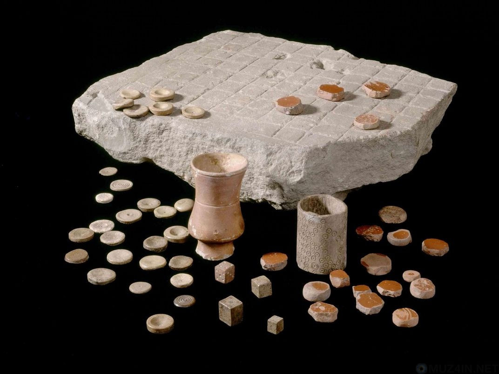
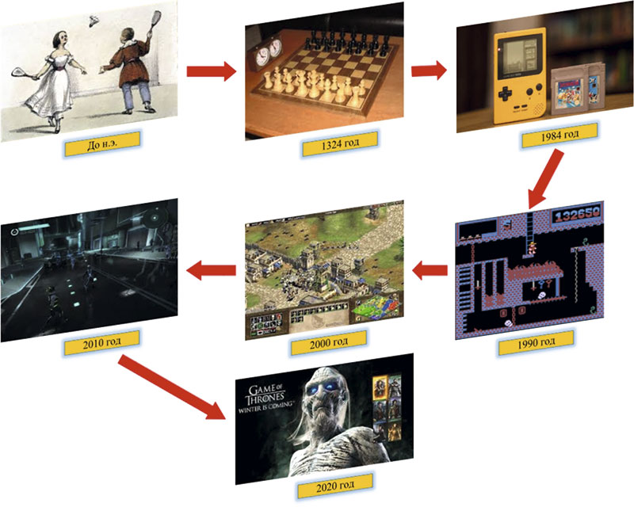

# Игра

🦓🛸⌛**Дисклеймер: **материал находится в процессе доработки. Если вы в чем-то несогласны с актуальным материалом — это нормально, мы тоже с ним не во всем согласны.

Что такое **игры** и из чего они состоят.

## Что такое игры?
----

Любая **игра** — это всегда [история](../History/index.md), история конкретного игрока.

**Игры** как таковые, наравне с понятием [игровое поведение](https://ru.wikipedia.org/wiki/%D0%98%D0%B3%D1%80%D0%BE%D0%B2%D0%B0%D1%8F_%D0%B0%D0%BA%D1%82%D0%B8%D0%B2%D0%BD%D0%BE%D1%81%D1%82%D1%8C), существуют [куда дольше](https://vakin.livejournal.com/2597415.html), чем любые другие медиа, дольше, чем книги, сказительство и ритуальные танцы. Игры существуют столько, сколько существует человечество.

Естественно, на тему игр проведено довольно много теоретических изысканий: «[Homo ludens](http://lib.ru/FILOSOF/HUIZINGA/huizinga.txt)» [Хейзинги](https://ru.wikipedia.org/wiki/%D0%A5%D1%91%D0%B9%D0%B7%D0%B8%D0%BD%D0%B3%D0%B0,_%D0%99%D0%BE%D1%85%D0%B0%D0%BD), «[Игры и люди](https://ru.wikipedia.org/wiki/%D0%98%D0%B3%D1%80%D1%8B_%D0%B8_%D0%BB%D1%8E%D0%B4%D0%B8)» [Роже Кайуа](https://ru.wikipedia.org/wiki/%D0%9A%D0%B0%D0%B9%D1%83%D0%B0,_%D0%A0%D0%BE%D0%B6%D0%B5), гуманитарно-научные [GNS](https://en.wikipedia.org/wiki/GNS_theory)/[Большая модель](https://rpg.fandom.com/ru/wiki/%D0%91%D0%BE%D0%BB%D1%8C%D1%88%D0%B0%D1%8F_%D0%BC%D0%BE%D0%B4%D0%B5%D0%BB%D1%8C) и [Game Studies](https://ru.wikipedia.org/wiki/%D0%98%D1%81%D1%81%D0%BB%D0%B5%D0%B4%D0%BE%D0%B2%D0%B0%D0%BD%D0%B8%D1%8F_%D0%B2%D0%B8%D0%B4%D0%B5%D0%BE%D0%B8%D0%B3%D1%80), [Психология игры](http://psychlib.ru/mgppu/EPi-1999/EPI-001.HTM) как отдельное направление психологии, [Теория игр](https://ru.wikipedia.org/wiki/%D0%A2%D0%B5%D0%BE%D1%80%D0%B8%D1%8F_%D0%B8%D0%B3%D1%80) как математический метод. И это только по верхам, то, что у всех на слуху, на расстоянии одного запроса в Google. По играм существует огромное количество накопленной за сотни лет информации.

### Компьютерные игры
**Компьютерные игры** — развлекательное программное обеспечение для персональных компьютеров, консолей и мобильных платформ (смартфонов и планшетов), VR/AR устройств.

Компьютерные игры моложе генетики и космических перелетов, все связанные с ними открытия совершаются здесь и сейчас, так сказать, «в реальном времени». Компьютерные игры агрегируют и катализируют все последние достижения как науки, так и культуры: [машинное обучение](https://ru.wikipedia.org/wiki/%D0%9C%D0%B0%D1%88%D0%B8%D0%BD%D0%BD%D0%BE%D0%B5_%D0%BE%D0%B1%D1%83%D1%87%D0%B5%D0%BD%D0%B8%D0%B5), [нейросети](https://ru.wikipedia.org/wiki/%D0%9D%D0%B5%D0%B9%D1%80%D0%BE%D0%BD%D0%BD%D0%B0%D1%8F_%D1%81%D0%B5%D1%82%D1%8C) и [искусственный интеллект](https://ru.wikipedia.org/wiki/%D0%98%D1%81%D0%BA%D1%83%D1%81%D1%81%D1%82%D0%B2%D0%B5%D0%BD%D0%BD%D1%8B%D0%B9_%D0%B8%D0%BD%D1%82%D0%B5%D0%BB%D0%BB%D0%B5%D0%BA%D1%82), [виртуальная](https://ru.wikipedia.org/wiki/%D0%92%D0%B8%D1%80%D1%82%D1%83%D0%B0%D0%BB%D1%8C%D0%BD%D0%B0%D1%8F_%D1%80%D0%B5%D0%B0%D0%BB%D1%8C%D0%BD%D0%BE%D1%81%D1%82%D1%8C) и [дополненная реальность](https://ru.wikipedia.org/wiki/%D0%94%D0%BE%D0%BF%D0%BE%D0%BB%D0%BD%D0%B5%D0%BD%D0%BD%D0%B0%D1%8F_%D1%80%D0%B5%D0%B0%D0%BB%D1%8C%D0%BD%D0%BE%D1%81%D1%82%D1%8C), [метавселенные](https://ru.wikipedia.org/wiki/%D0%9C%D0%B5%D1%82%D0%B0%D0%B2%D1%81%D0%B5%D0%BB%D0%B5%D0%BD%D0%BD%D0%B0%D1%8F), [нейроинтерфейсы](https://ru.wikipedia.org/wiki/%D0%9D%D0%B5%D0%B9%D1%80%D0%BE%D0%BA%D0%BE%D0%BC%D0%BF%D1%8C%D1%8E%D1%82%D0%B5%D1%80%D0%BD%D1%8B%D0%B9_%D0%B8%D0%BD%D1%82%D0%B5%D1%80%D1%84%D0%B5%D0%B9%D1%81), [геймификация](https://ru.wikipedia.org/wiki/%D0%98%D0%B3%D1%80%D0%BE%D1%84%D0%B8%D0%BA%D0%B0%D1%86%D0%B8%D1%8F) и [серьезные игры](https://news.itmo.ru/ru/news/8706/) — все это здесь.

**Совет**

!!! info ""
    «[Компьютерная игра](https://ru.wikipedia.org/wiki/%D0%9A%D0%BE%D0%BC%D0%BF%D1%8C%D1%8E%D1%82%D0%B5%D1%80%D0%BD%D0%B0%D1%8F_%D0%B8%D0%B3%D1%80%D0%B0)» или «[видеоигра](https://ru.wikipedia.org/wiki/%D0%92%D0%B8%D0%B4%D0%B5%D0%BE%D0%B8%D0%B3%D1%80%D0%B0)»? В большинстве случаев, это синонимы. Однако, бывают компьютерные игры [фактически без видео](https://store.steampowered.com/app/437530/A_Blind_Legend/?l=russian), а бывают компьютерные игры без компьютера (некоторые старые игровые автоматы). Иногда еще говорят “[электронная игра](https://en.wikipedia.org/wiki/Electronic_game)”.

    Используйте тот термин, который вам больше нравится, это не критично.

Однако, нужно учесть, что даже на консолях и на мобильных устройствах игры сильно отличаются друг от друга по игровым механикам и, в том числе, нарративу. По той простой причине, что игры — это в первую очередь интерфейс.

**Строго говоря:**

!!! info ""
    **Игра** — обладающий ценностью процесс решения проблемы с комфортной сложностью. [1]

Как только процесс обретения опыта становится некомфортным - игра перестает быть игрой. Она перестает развлекать и отвлекать (об этом — в следующих уроках), превращается в навязчивое обучение, симуляцию.

Наверное, еще стоит добавить, что обретенный в игре опыт должен откликаться в игроке востребованной **эмоциональной окраской**.

**Так же мы можем сказать, что:**

!!! info ""
    **Игра** — это интерактив между сознанием игрока и доступными ему интерфейсами.

    И

    **Игра** — это процесс обретения и один из способов получения опыта.
    А игры в чистом виде — это системы генерации опыта.

|  |
| --- |
| Настольная игра «Латрункули», обнаруженная в Римской Британии |

|  |
| --- |
| Развитие игр от древности до наших дней |

## Сноски
----

1. [↑](../Game/index.md#1_0)  [Денис Поздняков](https://sites.google.com/view/pozdnyakov-online/)
