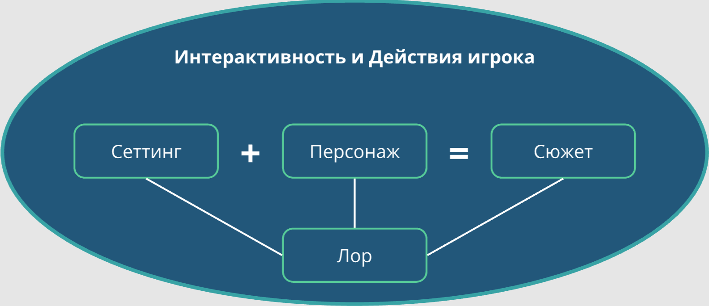

# История

🦓🛸⌛**Дисклеймер: **материал находится в процессе доработки. Если вы в чем-то несогласны с актуальным материалом — это нормально, мы тоже с ним не во всем согласны.

[1][2]
Любая **игра** — это всегда **история**, история конкретного игрока.

## Что такое история?
----

**История** — это совокупность фактов в хронологическом порядке, которые предполагают причинно-следственную связь (Кроуфорд, 1982).

Но в современном нарративном дизайне и игровой разработке **к истории принято относить любую информацию, переданную в художественной форме**.

[4]

## Элементы истории
----

Таким образом, **история** — это: [3]

### Действия реципиента
- Т. е. действия участника событий (игрока)
    - Обычно, к истории относят и самого участника событий; при этом игрока и персонажа, которым игрок управляет, принято различать.

### Подача и повествование
- Способ и особенности предоставления материала произведения;

### Тема, (управляющая) идея, смысл
- Основные мысли игры, **посыл** (premise), на котором разработчики делают акцент:
    - О чем разработчик хочет поговорить в своей игре?
        - *о любви, о дружбе, о ненависти?*
    - Что именно разработчик хочет сказать?
        - *что любить — больно?*
        - *что нужно дружить?*
        - *что не нужно ненавидеть?*

### Сюжет и композиция
- Последовательность событий, выстроенных по определенным правилам:
    - Не путайте сюжет персонажа и сюжет игрока!
        - В играх основной сюжет — это то, что происходит с игроком, а не с персонажем.

### Персонажи
- Действующие лица произведения и волеизъявители авторов;

### Сеттинг и атмосфера
- Место, время и условия.

!!! info ""
    Причем все это может относиться как ко всей игре, так и к отдельно взятым ее моментам.

    Говоря об истории, можно декомпозировать и обобщать смыслы, но важно помнить, что **история** (в чистом виде) **не равна <u>[нарративу](../Narrative/index.md)</u>**. **Нарратив игры — это история, воспринятая через интерактив. [5]**

    А **историю в игре создает игрок**.

## Совет
----

Компьютерные игры часто сравнивают с театром и кинематографом, но они куда ближе к реальной жизни, чем к театру или кино. Просто компьютерные игры — это утрированная, упрощенная реальность.

Именно поэтому в играх срабатывают методы привычного нам контроля окружающих и управления ситуацией — интрига, усиление интереса, принуждение действию. Игры ведут переговоры с игроком, давят на него, убеждают, «заставляют».

Настольные (карточные, стратегические, ролевые и т. д.) игры, а также [ролевые игры живого действия](https://ru.wikipedia.org/wiki/%D0%A0%D0%BE%D0%BB%D0%B5%D0%B2%D1%8B%D0%B5_%D0%B8%D0%B3%D1%80%D1%8B_%D0%B6%D0%B8%D0%B2%D0%BE%D0%B3%D0%BE_%D0%B4%D0%B5%D0%B9%D1%81%D1%82%D0%B2%D0%B8%D1%8F) — вот что можно с некоторым достаточно высоким приближением рассматривать как основные референсы компьютерных игр.

Однако в тех же [настольных ролевых играх](https://ru.wikipedia.org/wiki/%D0%9D%D0%B0%D1%81%D1%82%D0%BE%D0%BB%D1%8C%D0%BD%D0%B0%D1%8F_%D1%80%D0%BE%D0%BB%D0%B5%D0%B2%D0%B0%D1%8F_%D0%B8%D0%B3%D1%80%D0%B0) [мастер игры](https://ru.wikipedia.org/wiki/%D0%9C%D0%B0%D1%81%D1%82%D0%B5%D1%80_(%D1%80%D0%BE%D0%BB%D0%B5%D0%B2%D1%8B%D0%B5_%D0%B8%D0%B3%D1%80%D1%8B)) обладает условно безграничной властью над игровыми событиями и их участниками. А значит, течение настольной ролевой игры может быть в любой момент легко скорректировано в сторону оптимального интереса, наилучшего геймплея. В компьютерной ролевой игре такой свободы пока ни у кого нет.

Кстати, если уж стараться поддерживать мысль, что ААА игры — это кино-блокбастеры, тогда инди-игры — это не фильмы, это подкасты и [видеоблоги](https://ru.wikipedia.org/wiki/%D0%92%D0%B8%D0%B4%D0%B5%D0%BE%D0%B1%D0%BB%D0%BE%D0%B3).
