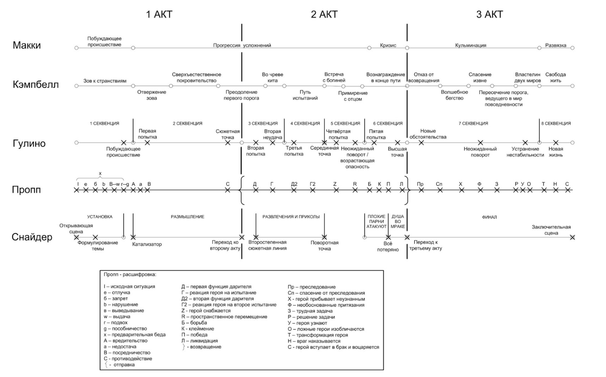
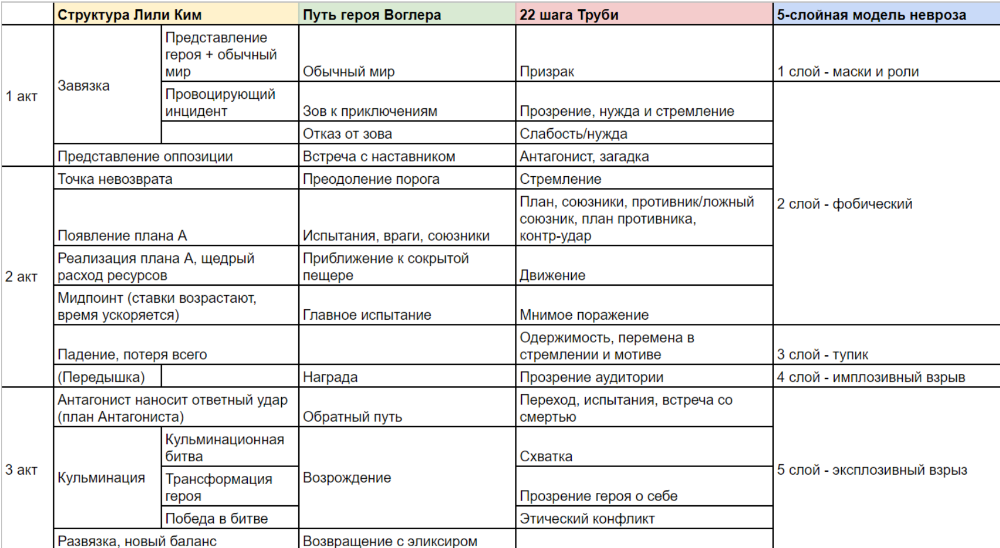
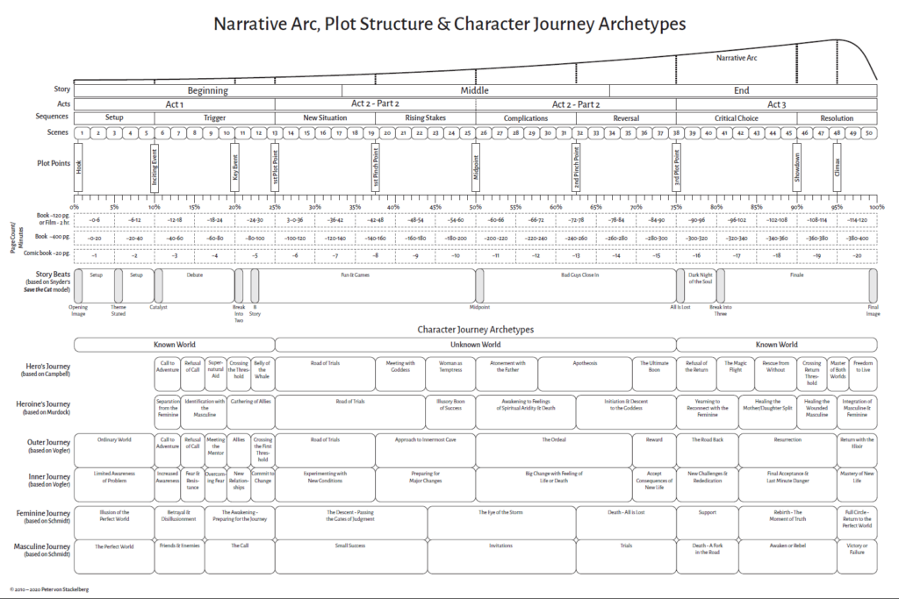
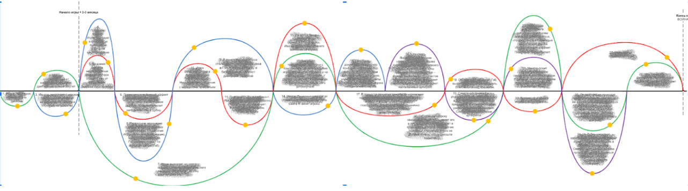

# Сюжет

🦓🛸⌛**Дисклеймер: **материал находится в процессе доработки. Если вы в чем-то несогласны с актуальным материалом — это нормально, мы тоже с ним не во всем согласны.

**[1] - [7]**

*«Сюжет — это персонаж, выражаемый действием»*
Аристотель

<u>[Сюжет](https://ru.wikipedia.org/wiki/%D0%A1%D1%8E%D0%B6%D0%B5%D1%82)</u> — в общем смысле не более чем механика**[8][9]**, с помощью которой мы создаем геймплей, причем далеко не только его нарративную часть. Мы привыкли судить об игровом сюжете по <u>[столпам сюжетного жанра](https://ru.wikipedia.org/wiki/Red_Dead_Redemption_2)</u>, тогда как в большинстве компьютерных игр, на самом деле, есть только тема и [фабула](https://ru.wikipedia.org/wiki/%D0%A4%D0%B0%D0%B1%D1%83%D0%BB%D0%B0). Но и они так размыты геймплеем, что именно геймплей и становится сюжетом.**[10]**

**Сюжет игры — это понятное, интересное, умное, неожиданное объяснение геймплея.**

Хороший сюжет хорошей игры — не более чем запоминающаяся последовательность критических действий игрока на отдельном отрезке геймплея. Вспомните, как вы отрывали ноги пауку в [Limbo](https://ru.wikipedia.org/wiki/Limbo_(%D0%B8%D0%B3%D1%80%D0%B0)) или как падали из зависшего над обрывом вагона поезда в [Uncharted 2](https://ru.wikipedia.org/wiki/Uncharted_2:_Among_Thieves) — вот это и было настоящим сюжетом вашего прохождения, а в чем там в конце концов дело было… Большинство игроков эти игры целиком не прошло.**[11]**

Конечно, всегда очень хочется, чтобы сюжет компьютерной игры обладал всеми признаками и наработками качественного киносюжета, отвечая одной из этих структур:

Похожая таблица от [Марии Кочаковой](https://t.me/horrorpizdezh), но с более современными персоналиями, концепциями (и терминами):

В ставшем уже [классическим пособии для сценаристов Роберта Макки](https://www.ozon.ru/product/istoriya-na-million-dollarov-master-klass-dlya-stsenaristov-pisateley-i-ne-tolko-istoriya-na-4100239/) говорится, что сюжеты должны:

1. Подстегивать любопытство, ставить вопросы и поддерживать желание аудитории на них отвечать, при этом избегая ложных тайн (искусственного сокрытия фактов, нарочитой недосказанности).
1. Содержать неожиданности и уметь удивлять. Как хорошо говорит Макки — если кто-то звонит в дверной звонок, ему не должны открыть… дом должен взорваться! Что-то иное должно произойти! Должна возникнуть брешь между тем, что предвиделось, и конечным результатом.

К сожалению, это и еще несколько общих и очевидных моментов — все, что мы можем заимствовать из кинематографа и литературы, не превращая игру в интерактивную книгу или интерактивный фильм.

Игры во многом устроены иначе, у них другая динамика, другая точка приложения внимания зрителя, другая интенсивность подачи нарратива.

Игры ближе по сюжету к «вертикальным» ([процедурным](https://ru.wikipedia.org/wiki/%D0%A2%D0%B5%D0%BB%D0%B5%D1%81%D0%B5%D1%80%D0%B8%D0%B0%D0%BB)) сериалам, изредка прорезаемым кусками горизонтального сюжета. Однако вспомните, что происходит в начале таких вот «горизонтальных» серий: зрителю короткой нарезкой пересказывают куски сюжета, происходившего серии, а то и сезоны назад. Но создатели сериалов обычно знают, когда их зритель последний раз смотрел сериал — скорее всего, не более чем неделю назад. А вот когда игрок последний раз был в игре и что он помнит из сюжетных коллизий — разработчикам, как правило, совершенно непонятно.

Попробуйте взять серьезную сюжетную RPG, например [Divinity: Original Sin](https://store.steampowered.com/app/373420/Divinity_Original_Sin__Enhanced_Edition/), пройти ее на треть, а потом бросить на пару месяцев. Вероятность, что вы вернетесь после такого перерыва, очень невелика. А если все-таки вернетесь — предпочтете начать игру заново, потому что альтернатива (перечитывать содержание сюжетных квестов в игровом журнале) не содержит в себе ключевого элемента игры — саму игру.

Для того чтобы восстановить в памяти сюжет сериала, достаточно «пролистать» несколько предыдущих серий. Но чтобы полноценно восстановить в памяти сюжет игры — игру нужно переиграть. А на это готовы пойти далеко не все игроки.

Конечно, в силу своей циклической природы, игры заимствуют из кино ритмическую структуру и сюжетные арки, и всегда можно делить историю игры на эпизоды — мы уже говорили об этом в предыдущем уроке.

Формируя сюжет игры от эпизодов, имеет смысл проверять, продвигает ли каждый эпизод историю вперед, содержат ли эпизоды моменты напряжения. Однако не следует забывать, что настоящим моментом напряжения, скорее всего, будет правильно сбалансированная боевая сцена или сессия мини-игры. И тогда весь эффект от нарративного напряжения может пропасть втуне или может быть проскипан кнопкой «дальше». **Вы не можете запретить игроку пропускать ролики и диалоги.**

Чуть лучше дела обстоят со сценами. Но **в играх сюжетный нарратив используется** в первую очередь **для перехода между сценами, тогда как сама сцена формируется геймплеем** — опять же, боевкой, какой-то мини-игрой. И задача такой связки - подготовить игрока к следующей сцене, поэтому у вас не будет слишком большого пространства для эмоционального маневра, усиления драматического эффекта.

Вы можете спрашивать себя, зачем нужна та или иная сцена, что она меняет для героя игры, а что меняет в чувствах игрока (что он должен почувствовать в конце сцены?), как эта сцена влияет на игру в целом… Но в мобильной игре про обустройство дома таких сцен будут сотни, тогда как между ними игрока будут спамить сессиями Match3.

**Не надейтесь на сюжет.**

Как бы интересно вы ни завернули действие, какую бы сильную кульминацию ни подготовили — игроки могут до всего этого великолепия просто не дойти. Им помешает сложность, а может быть, длительность игры (ведь это не фильмы на 1,5-2,5 часа, даже считающиеся «короткими» игры имеют среднюю продолжительность 8+ часов). Размещайте сюжетные крючки равномерно, но не томите игрока ожиданием — он может и не дождаться или просто забыть про этот крючок.

А также помните, что **чем сложнее и интереснее сюжет — тем сложнее и дороже будет его реализация в игре.**

## Комментарии
Еще один вариант сведения в единую таблицу классических подходов к построению сюжета:

----

[И еще альтернативная версия в pdf](https://www.helpingwritersbecomeauthors.com/wp-content/uploads/2020/07/Pillars-of-Story-Structure-V9.pdf). **[12]** 

----

А вот так может выглядеть визуализация сюжетных арок игры, где по y- — отрицательные события, по y+ — положительные, а по x — таймлайн:

----

Работая с историей игры и применяя к ней классические приемы сценаристики, постоянно проверяйте, не мешают ли они геймплею.

Всегда нужно помнить, что игрок все равно создаст свою историю, параллельную заложенному вами игровому сюжету. Историю своего прохождения игры, которую игроку нужно позволить развивать — для этого и нужны все эти краткосрочные цели, задачи с небольшим горизонтом планирования, гринд, сайд-квесты и другие «фишки» для сиюминутного удовольствия.

----

Придумывая сюжетное событие, постоянно спрашивайте себя:

- **Какая цель у данного события с точки зрения игры, что оно дает игре?**

Если в книге каждое событие должно работать на раскрытие персонажей, а в фильме — на развитие сюжета, то в игре — на геймплей.

----

**Недосказанность**

Есть такая условно японская штука, как «искусство умолчания», заключающаяся в том, что значение есть не только у иероглифов, но и у пространства между ними. Да, практически в любой письменности слова отделяются друг от друга пробелами, но японцы формально пошли дальше, и, например, в их изобразительном искусстве пустоте придается такое же значение, как и непосредственно изображению.

Если в произведении есть «пустое пространство», его всегда можно додумать, заполнить своей фантазией. Если же автор расписал все до мельчайших деталей - в произведении нет места сотворчеству реципиента.
