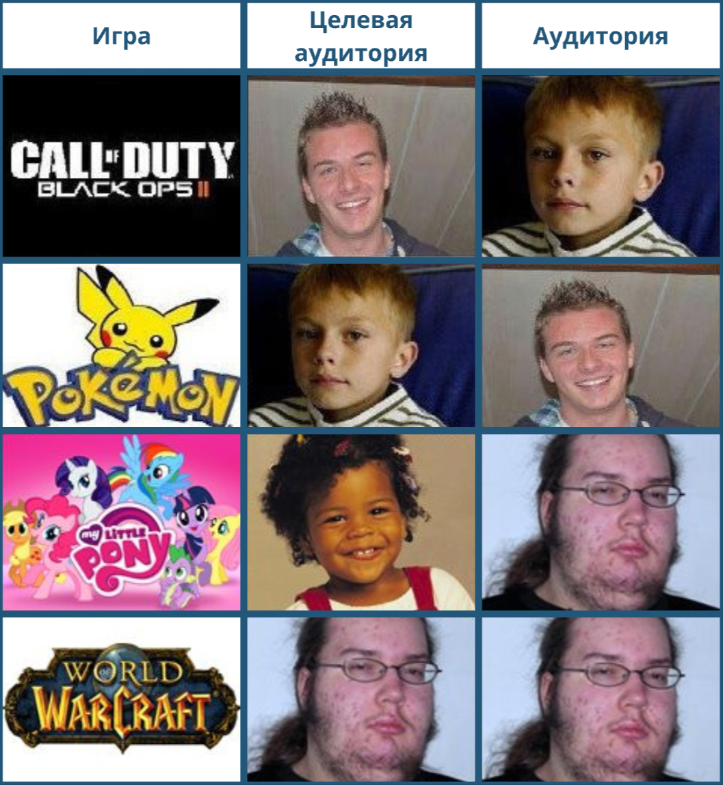

# Целевая аудитория

🦓🛸⌛**Дисклеймер: **материал находится в процессе доработки. Если вы в чем-то несогласны с актуальным материалом — это нормально, мы тоже с ним не во всем согласны.

**[1][2][3]**

!!! info ""
    *Люди хотят получать то, что они и так знают, но не так, как они этого ожидают.*

## Что такое целевая аудитория
----

Не так уж легко заранее угадать/понять аудиторию вашей игры: создатель [Minecraft](https://ru.wikipedia.org/wiki/Minecraft) делал игру для тридцатилетних гиков, а в нее, со временем пришла толпа детей 6—12 лет. Казалось бы, это можно было легко предвидеть, ведь [Minecraft](https://ru.wikipedia.org/wiki/LEGO) — это цифровой аналог Lego. Но тогда, в 2009 году, никто и помыслить не мог, что буквально через несколько лет у каждого ребенка будет доступ к мобильному устройству с отличным тачскрином. А ведь есть еще куча подростков 16-20 лет, играющих на [РП-серверах](https://cubiq.ru/luchshie-rp-servery-minecraft/).

Ориентация на конкретную аудиторию совсем не говорит о том, что ваша игра ей подойдет. Так же как последующее маркетинговое таргетирование не говорит о том, что к вам придут именно те, кто вам нужен, и уж точно не говорит о том, что они останутся. Поэтому не так важно научиться заранее верно определять аудиторию, сколько научиться эту аудиторию разделять и анализировать.

Мы должны понимать свою [целевую аудиторию](https://ru.wikipedia.org/wiki/%D0%A6%D0%B5%D0%BB%D0%B5%D0%B2%D0%B0%D1%8F_%D0%B3%D1%80%D1%83%D0%BF%D0%BF%D0%B0).

**Целевая аудитория** — это та, на которую четко ориентирован продукт. Это совершенно не значит, что нецелевой аудитории он не подойдет, просто разработчики и маркетологи ориентируют продвижение игры на эту конкретную группу игроков.

Еще раз: **ЦА — это не все те, кто купил и/или играет в игру, а те, для кого игра делалась**.

При этом важно понимать, что выбранная ЦА может не совпадать с аудиторией, которая фактически доступна разработчикам игры. [Animal Crossing](https://ru.wikipedia.org/wiki/Animal_Crossing) ориентирована на детскую аудиторию, но большая часть аудитории [Nintendo Switch](https://ru.wikipedia.org/wiki/Nintendo_Switch) — [мужчины в возрасте от 24 до 35 лет](http://chuyplays.com/why-demographics-matter-for-animal-crossing-switch), а значит, и средний игрок в Animal Crossing — мужчина 24–35. Здесь мы наблюдаем несовпадение ЦА с демографическим параметром аудитории, но насколько это плохо/важно/нужно переделать — проблема продюсеров и маркетологов.

**Другой пример «смещения» аудитории**: (например) у нас детская игра и, казалось бы, основная ее задача — понравиться детям. Однако до определенного момента развлечения детей контролируются родителями, и тем более это касается покупок компьютерных игр, а также покупок, которые дети совершают в игре.

Любая детская игра должна понравиться не только ребенку (первичная ЦА), но и его родителям (вторичная ЦА), иначе ребенку придется играть в нее тайком, и ни о какой эффективной монетизации уже не будет идти речи — родитель просто откажет ребенку в совершении внутриигровой покупки. 

А значит, нужно не просто разрабатывать интересную игру, но заранее адаптировать ее под положительное восприятие взрослыми.

Что может привлечь родителя в игре, которой увлечен его ребенок? Образовательный аспект, условная полезность. Визуальный стиль или персонажи, связанные с детством родителя (а значит, по умолчанию хорошие и нужные — ведь родитель вырос на них, стал тем, кто он есть).

## Как работать с ЦА
----

1. Делать механики, которые могут заинтересовать ЦА (даже если ЦА этого еще не знает);
1. Ориентировать на ЦА арт, сеттинг, персонажей и сюжетные ходы;
1. Прислушиваться к мнению ЦА.

1*. Объяснять, почему не все, что хочет ЦА, можно сделать;
1. Исходя из их поведения, быть готовым к их реакциям.

Еще раз:

1. Целевая аудитория — это всегда четкий таргет/когорта/сегмент;
1. ЦА может быть несколько, но это дорого;
1. ЦА — это не медиана, не мода и не усреднение;
1. Иногда ЦА — всего 1% игроков, но это — ваш кор, ваши амбассадоры, ваши фанаты… и со временем ваши главные проблемы.

Вот ссылка на хорошую статью о том, [Как составить портрет клиента (целевой аудитории): инструкция с примерами](https://vc.ru/marketing/156147-kak-sostavit-portret-klienta-celevoy-auditorii-instrukciya-s-primerami) из области сервисной продукции. Вполне применимо к играм.

## Руководство к действию
----

- Выясните у продюсеров, маркетологов, других гейм-дизайнеров или сформулируйте сами понимание целевой аудитории вашего проекта.
    - Исходя из целевой аудитории, рассмотрите имеющиеся у вас инструменты, механики, основные элементы истории.
        - Они подходят этой ЦА?
