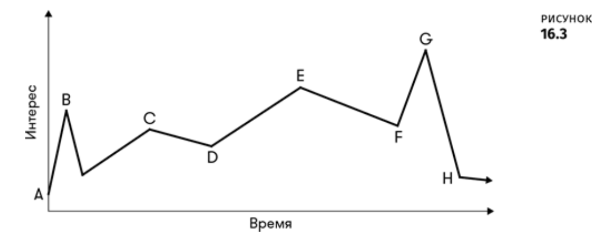
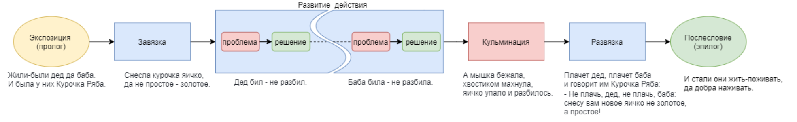

# Темп и Ритм

🦓🛸⌛**Дисклеймер: **материал находится в процессе доработки. Если вы в чем-то несогласны с актуальным материалом — это нормально, мы тоже с ним не во всем согласны.

## Темп и Ритм
----

Тайминги позволяют задавать в игре ритм, и, если вы приглядитесь, то увидите, что лучшие игры — ритмичны.

Людское восприятие идеально настроено на восприятие ритмов, возможно потому, что ритм — это цикл, а мы от природы цикличны: цикл жизни, <u>[цикл Кребса](https://ru.wikipedia.org/wiki/%D0%A6%D0%B8%D0%BA%D0%BB_%D1%82%D1%80%D0%B8%D0%BA%D0%B0%D1%80%D0%B1%D0%BE%D0%BD%D0%BE%D0%B2%D1%8B%D1%85_%D0%BA%D0%B8%D1%81%D0%BB%D0%BE%D1%82)</u>, <u>[перцептивный цикл](https://ru.wikipedia.org/wiki/%D0%9F%D0%B5%D1%80%D1%86%D0%B5%D0%BF%D1%82%D0%B8%D0%B2%D0%BD%D1%8B%D0%B9_%D1%86%D0%B8%D0%BA%D0%BB)</u>, [циркадный ритм](https://ru.wikipedia.org/wiki/%D0%A6%D0%B8%D1%80%D0%BA%D0%B0%D0%B4%D0%BD%D1%8B%D0%B9_%D1%80%D0%B8%D1%82%D0%BC), цикл времен года и т. д. Мы во всем ищем ритмы, а находя — начинаем им следовать.

А **игровые тайминги — это темп ритма**. В чем разница между темпом и ритмом?

Если совсем упрощать, то **[темп](https://ru.wikipedia.org/wiki/%D0%A2%D0%B5%D0%BC%D0%BF) — это то, как быстро или медленно что-то происходит** (например, выполняется музыкальное произведение), в то время как **[ритм](https://ru.wikipedia.org/wiki/%D0%A0%D0%B8%D1%82%D0%BC_(%D0%B7%D0%BD%D0%B0%D1%87%D0%B5%D0%BD%D0%B8%D1%8F)) — это размещение событий** (например, звуков) **во времени, в регулярном и повторяющемся шаблоне**.

Темп и ритм — это, по сути, продолжение темы игровых циклов, так как большинство игр — это ритмическое чередование участков с высоким и низким темпом. В контексте этого утверждения правилом хорошего тона считается постоянное «подкидывание» игроку плавного перехода к следующему игровому моменту, задающему определенный (другой!) ритм.

<u>[Шелл Джесси, Геймдизайн \[Как создать игру, в которую будут играть все\] \[litres\]](https://it.wikireading.ru/hq6mH0RMjQ)</u>

Изменение темпа и ритма влияет на переживания игрока и на процесс повествования, каким мы видим его в игре. Например, это позволяет построить нарастание напряжения от **завязки** к **конфронтации**, а затем — к **развязке**: та самая пресловутая <u>[трехактная структура](https://ru.wikipedia.org/wiki/%D0%A2%D1%80%D1%91%D1%85%D0%B0%D0%BA%D1%82%D0%BD%D0%B0%D1%8F_%D1%81%D1%82%D1%80%D1%83%D0%BA%D1%82%D1%83%D1%80%D0%B0)</u> (почему пресловутая — см. в конце этой страницы).

## Pacing
----

**[1]-[2]**

Пресловутый пейсинг (<u>[pacing](https://podcasts.apple.com/us/podcast/pacing-in-videogames/id418900396?i=1000093702007)</u>) из <u>[некоторых «обучающих» видосов](https://www.youtube.com/watch?v=ftiHgyFt72M)</u> — это и есть тот самый «темпоритм», скорость проистечения и динамика смены событий. Хороший пейсинг, хорошие темп и ритм — это продуманное чередование медленных и быстрых участков геймплея, а также его нарративных и интерактивных составляющих.

Например, излишнее информирование игрока сбивает темп игры, но делает моменты вынужденного отдыха не такими скучными.

После уничтожения сложного босса у игрока точно не будет желания сразу кидаться в бой с новым противником. Если вы просто дадите игроку возможность передохнуть — сделаете длинный коридорный перелет на <u>[маунте](https://coremission.net/slovar/chto-takoe-maunt/)</u> к городу/хабу — игрок заскучает и, следуя за своей усталостью, возможно, прервет игровую сессию. Но вы можете выдать игроку предмет-награду, которую он захочет сразу же примерить и оценить изменение характеристик, ролик-диалог с побежденным противником или новый квест, содержание которого следует внимательно изучить. Это собьет темп происходящего, даст игроку время на отдых, но также займет его делом, важным для дальнейшего прохождения игры.

## Трехактная структура
----

**[3]**

Мы еще будем говорить о структуре произведений в одном из следующих уроков, но:

В реальном мире никто не строит сюжеты по трехактной системе, это — бессмысленное ограничение. Можно сказать, что минимальная структура сюжета будет шести-актная:

- экспозиция/пролог
- завязка
- действие
- кульминация
- развязка
- эпилог
