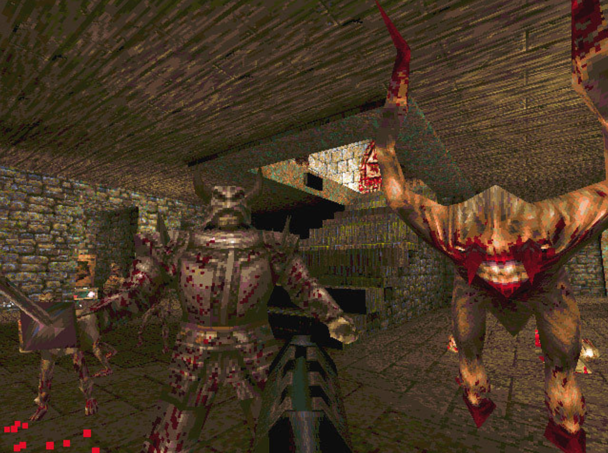

# Текст

🦓🛸⌛**Дисклеймер: **материал находится в процессе доработки. Если вы в чем-то несогласны с актуальным материалом — это нормально, мы тоже с ним не во всем согласны.

**[1]-[5]**

*Текст — ткань из цитат.*
[Ролан Барт](https://ru.wikipedia.org/wiki/%D0%91%D0%B0%D1%80%D1%82,_%D0%A0%D0%BE%D0%BB%D0%B0%D0%BD), «[Смерть автора](https://ru.wikipedia.org/wiki/%D0%A1%D0%BC%D0%B5%D1%80%D1%82%D1%8C_%D0%B0%D0%B2%D1%82%D0%BE%D1%80%D0%B0)»

Не бойтесь текста, просто не злоуботребляйте им.

Текст — тоже инструмент, точнее, он становится им, когда начинает создавать в читателе нарратив.

Использование текста в донесении нарратива — это как использование инструмента «игровая камера» в механике стрельбы: сделали плохую камеру — получилась плохая стрельба. Вот и здесь: написали неказистый текст — получили неказистый нарратив.

По разной статистике, текст в играх, не требующих для своего прохождения обязательного чтения, читает от 4 до 10 процентов игроков. Даже в таких играх, как «[Ведьмак](https://ru.wikipedia.org/wiki/%D0%92%D0%B5%D0%B4%D1%8C%D0%BC%D0%B0%D0%BA_(%D0%B8%D0%B3%D1%80%D0%B0))», многие предпочитают не вчитываться в диалоги или выбирают ответ исходя из совета в прохождении на [YouTube](https://www.youtube.com/).

Вы можете сказать: «Подожди, но я видел кучу игр, в которых на экраны вывешивались бесконечные простыни текста, и эти игры были очень популярны». Бесспорно. Не многие поверят, но когда-то игры обладали просто чудовищной графикой, и при этом были невероятно популярны. Более того, когда-то такая графика считалась верхом совершенства.

[Quake, id Software, 1996](https://ru.wikipedia.org/wiki/Quake)

Однако текст  все еще остается самым быстрым, хоть и довольно скучным способом донесения больших объемов точной и/или сложной информации. При этом его эффективность в плане воздействия на игрока не очень высока.

Зато можно показать игроку отличную трехмерную картинку (например) горы и надеяться, что именно ее он распознает как «самая большая в мире гора». А можно написать это текстом на экране и моментально добиться пусть дешевого и слабого, но эффекта. 

Ключевое слово тут — дешевого. Так что вам все равно придется работать с текстом. Как минимум вы будете принимать его у сценаристов, редакторов, копирайтеров и авторов диалогов. А значит, вы должны разбираться в его написании.

Существует много правил, особенностей и критериев качества использования текста в компьютерных играх. Но обычно выделяют следующие, нарушение которых является типичной ошибкой новичка:

- **Функциональность**. Текст должен выполнять какую-то функцию. Что-то доносить, о чем-то рассказывать. Если текст можно убрать из игры и единственное, что она потеряет, — это плашку с текстом, значит, его нужно убрать. Если что-то можно с тем же успехом и так же легко показать — значит, здесь не нужен текст. Исключением являются звуки: в игры играют в том числе и плохо слышащие люди, часть звуков должна быть поддержана субтитрами;
- **Длина**. В индустрии существует понятие «**твит-квест**» — описание задания текстом длиной 140 символов (когда-то таким было ограничение поста в «Твиттере»). **140 символов (с пробелами)** — примерно столько человек в состоянии прочитать не напрягаясь и не думая: «О, боги, сейчас придется читать текст». С каждым годом это количество уменьшается, и сейчас составляет 90–120 символов; **[6]**
- **Оформление**. За оформление текста в компьютерных играх традиционно отвечают специалисты UI, но нарративным дизайнерам рекомендуется за ними приглядывать. Помните, что игроки могут использовать разные разрешения экрана и что у них может быть по-разному настроена яркость;
- **Время и место**. Игрок должен контролировать момент и позицию появления текста. Текст не должен заслонять от игрока элементы интерфейса, не должен появляться тогда, когда его не успеют прочесть, — в споре с геймплеем перевес будет не в пользу текста. Текст не должен быть навязчив, если только он не является элементом геймплейной индикации;
- Конечно, текст должен соответствовать **стилю и сеттингу**: если бандиты в вашей игре ругаются строчками Фета — вы либо хотите донести до игрока что-то очень конкретное, либо бессмысленно рвете ему шаблон;
- А еще любой художественный текст, особенно если это диалог, должен «поворачивать» что-то в голове читателя, ввергать его в микрокатарсис, удивлять.

Игровые тексты должны обогащать игру, выполнять геймплейные и драматические функции, поддерживать основной нарратив игры и в первую очередь не быть скучными.

Кстати, у разработки текстовой части проекта тоже есть дорогие этапы. Например, система локализации, для которой недостаточно просто отдать десяток таблиц с несколькими сотнями тысяч слов переводчикам и редакторам. Потом еще нужно как-то поместить переводы назад в игру, а также предоставить игроку (и системе) возможность переключать языки. Для автоматизации этого процесса нужны программисты и недели работы.

Ну и не забывайте, что хотя балет не популярен, его все еще смотрят и танцуют. А значит, и текст всегда будет востребован.

### Совет
----

Рекомендую почитать дополнительно статью [Диалоги](../Dialogues/index.md)

----

Донося до игрока важные мысли и объясняя ему игровые задачи, помните про [академический абзац](https://bureau.ru/bb/soviet/20130818/#:~~:text=%D0%90%D0%B1%D0%B7%D0%B0%D1%86%20%D1%81%D0%BE%D1%81%D1%82%D0%BE%D0%B8%D1%82%20%D0%B8%D0%B7%20%D1%82%D1%80%D1%91%D1%85%20%D1%87%D0%B0%D1%81%D1%82%D0%B5%D0%B9,%D0%B4%D0%B0%D1%91%D1%82%D1%81%D1%8F%20%D0%BF%D1%80%D0%BE%D0%B8%D0%B7%D0%B2%D0%BE%D0%B4%D0%BD%D0%B0%D1%8F%20%D0%BE%D1%82%20%D1%82%D0%B5%D0%B7%D0%B8%D1%81%D0%B0%20%E2%80%94%20%D0%B2%D1%8B%D0%B2%D0%BE%D0%B4.) — это позволит вам минимизировать объем текста без потери его информативности. Концентрируйте суть в первом предложении, объясняйте вторым, делайте вывод в третьем.

Если требуется не только донести, но и закрепить важную информацию, не стесняйтесь использовать «метод младшей школы» — периодическое повторение одной и той же информации, например, устами разных NPC.

Выстраивая художественные диалоги персонажей, опирайтесь не на описания событий, а на вызванные ими эмоции — так текст будет короче, а его смысл ярче.

Если вас попросили переработать технические тексты или написать туториал, помните, что критически важный текст, такой как сообщения об ошибочном действии, должен содержать минимум информации о том, что пошло не так, и прямую рекомендацию о том, что теперь нужно делать.

**Создавайте разумный дефицит сюжетной информации**. Этим вы повысите вероятность прочтения художественного текста. Подводите читателя к выводу, а не проговаривайте его напрямую. Во время Второй мировой войны немцы обратили внимание, что пропаганда становится эффективнее, если не помещать в нее призыв, а подавать факты так, чтобы целевая аудитория сама сформировала призыв в голове.**[7]**

Работая над [текстовой игрой](https://ru.wikipedia.org/wiki/Interactive_fiction), помните, как много всего можно выжать из обычного текста:

- Можно по-разному предлагать выбирать текстовое действие (например, требовать нескольких нажатий), давать возможность вводить текст вручную или кликать мышью на определенную (обусловленную нарративом) часть предложения;
- Можно вести повествование от первого, второго и третьего лица;**[8]**
- Можно «играть» с форматом текста — шрифтом и размером, цветом текста и фона.
    - **Важный момент**: не используйте шрифт с засечками, он для текста на бумаге! А еще почитайте про [субпиксельное позиционирование](https://en.wikipedia.org/wiki/Subpixel_rendering).
- Можно по-разному размещать текст на экране, сопровождать его появление картинками и звуками;
- Можно проявлять текст постепенно или, наоборот, скрывать его в какой-то момент, мигать текстом;
- Можно предлагать игроку по-разному реагировать на обстоятельства, давать выборы, а также отображать настроение, характер выборов и реплик непосредственно через текст;
- И еще много других вариантов…

Не испытывайте терпение игрока. Каждая фраза должна вознаграждать игрока смыслом, продвижением по сюжету, интересной красивой формой, хорошим ритмом. Даже если у вас [интерактивная новелла](https://ru.wikipedia.org/wiki/%D0%92%D0%B8%D0%B7%D1%83%D0%B0%D0%BB%D1%8C%D0%BD%D1%8B%D0%B9_%D1%80%D0%BE%D0%BC%D0%B0%D0%BD) — пустые (но красивые и ритмичные) фразы можно делать только на фоне красивой картинки (но желательно один раз для каждой конкретной картинки).

Художественное описания предметов, персонажей и т. п., хороший способ переложить текстовый нарратив в пространство игры, как в [Betrayal at Krondor](https://ru.wikipedia.org/wiki/Betrayal_at_Krondor), [Destiny](https://www.bungie.net/7/ru/Destiny) и играх [серии Souls](https://ru.wikipedia.org/wiki/Souls_(%D1%81%D0%B5%D1%80%D0%B8%D1%8F_%D0%B8%D0%B3%D1%80)).

Количество текста, которое будет оправдано в конкретный момент, зависит от того, что происходит на экране, какой игроку доступен интерактив до/сейчас/потом. Посмотрите, сколько текста в [Vampire: The Masquerade — Coteries of New York](https://store.steampowered.com/app/1096410/Vampire_The_Masquerade__Coteries_of_New_York/) или в том же «[Клубе Романтики](https://apps.apple.com/ru/app/%D0%BA%D0%BB%D1%83%D0%B1-%D1%80%D0%BE%D0%BC%D0%B0%D0%BD%D1%82%D0%B8%D0%BA%D0%B8-%D0%BC%D0%BE%D0%B8-%D0%B8%D1%81%D1%82%D0%BE%D1%80%D0%B8%D0%B8/id1300588558)». Текст — это инструмент, если вы его используете — для этого должна быть причина.

Воспринимайте текст как возможность крутить камеру в игре:

- При виде из глаз крутить камерой нужно и удобно;
- Но если у вас двухмерный платформер — вам не нужно свободное вращение камеры в трех координатах.

Тоже самое верно и для текста. В какие-то моменты его выгодно использовать, но в другие он попросту мешает.

----

[Текстовые игры](https://ru.wikipedia.org/wiki/Interactive_fiction) — это не проза, а стихи без рифмы или в крайнем случае ритмическая проза.**[7]**

В своей основе текст обладает нарративными свойствами, схожими с левел-дизайном. Фактически это повествование через окружение, когда мы визуальной компоновкой слов/букв/предложений/абзацев и содержащимися в них смыслами доносим до игрока определенную информацию.

Это касается и размерностей синтаксических конструкций, и особенностей подачи, и требований к динамике. **Геймплей цикличен и ритмичен, а значит, и текстовая игра должна быть таковой.**

Избегайте поэтической оборотистости — то, что хорошо воспринимается в литературе, в играх смотрится не очень. **Чтобы текст был атмосферным и глубоким и при этом не терял емкости и ритма, используйте не сложные фразы, а сложные слова.**
