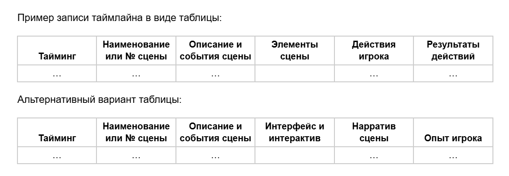

# Таймлайн

🦓🛸⌛**Дисклеймер: **материал находится в процессе доработки. Если вы в чем-то несогласны с актуальным материалом — это нормально, мы тоже с ним не во всем согласны.

**[1]** 

Нарратив — отличный способ не только отсекать сущности друг от друга (задавая тем самым ритм и темп), но и фиксировать таймлайн событий в игре.

**Таймлайн — это визуальное представление каких-либо событий, явлений, лиц или предметов в хронологическом порядке; временная шкала.**

Что это дает и как этим пользоваться:

1. Разбиваем игру на крупные циклы-акты и смотрим, насколько в унисон работает рассказанная в них история. Не окажутся ли перед нами отдельные игры, номинально объединенные визуальными ассетами и ключевыми механиками:

    1. Хороший обратный пример: в <u>[Spore](https://ru.wikipedia.org/wiki/Spore)</u> мы имеем 4 игры, отличающиеся механиками и ассетами, но объединенные единой историей, развивающейся в рамках предложенного игровыми циклами таймлайна.
1. Теперь разделяем циклы-акты на меньшие циклы-эпизоды (блоки сцен):

    1. Как там с деталями, не перегружен ли игрок нарративом на этом временном отрезке или, наоборот, нужно добавить?
1. Ритм появляется при наличии четких начала, середины и конца (технически, достаточно [акцентов](https://ru.wikipedia.org/wiki/%D0%90%D0%BA%D1%86%D0%B5%D0%BD%D1%82) и [пауз](https://ru.wikipedia.org/wiki/%D0%9F%D0%B0%D1%83%D0%B7%D0%B0_(%D0%BC%D1%83%D0%B7%D1%8B%D0%BA%D0%B0)), но если будут только они — это будет весьма странная игра): проверьте, что они присутствуют в ваших циклах-эпизодах.

Таким образом можно бесконечно декомпозировать игру в рамках таймлайна: циклы-сцены, циклы-действия, циклы-[биты](https://zen.yandex.ru/media/id/5e1dbc93bc251400b0dc36e5/chto-takoe-bit-v-scenarii-5f1965fcd3a4a0149e3be9d4), циклы-тики и т. д.

Часто, работая над проектом, гейм-дизайнеры составляют таймлайны игровых событий:

**Уровень 1**

1. Катсцена: 1 минута
1. Обучение: 2 минуты
1. Диалог с NPC:

    1. 5 реплик NPC в среднем по 3 секунды чтения каждая;
    1. 3 ответа игрока в среднем по 5 секунд чтения/принятия решения каждая.
1. Перемещение: 10 секунд
1. Пазл на оперирование объектами: 45 секунд
1. Сражение: 30 секунд
1. Перемещение: 10 секунд
1. Пазл на перемещение: 25 секунд
1. Сражение: 45 секунд
1. Катсцена: 30 секунд
1. И т. д.

— а потом плейтестами проверяют тайминги на пригодность и интересность.

Кстати, обычно дизайнерской информации в каждом таком пункте сильно больше: таймлайн превращается в [userstory](https://ru.wikipedia.org/wiki/%D0%9F%D0%BE%D0%BB%D1%8C%D0%B7%D0%BE%D0%B2%D0%B0%D1%82%D0%B5%D0%BB%D1%8C%D1%81%D0%BA%D0%B8%D0%B5_%D0%B8%D1%81%D1%82%D0%BE%D1%80%D0%B8%D0%B8), описывающую действия не персонажа, а игрока.

Конечно, в таких таймлайнах интерактивная свобода (агентивность, о которой позже) конфликтует с линейностью описания. Но одна из задач гейм-дизайнера: найти самое увлекательное прохождение каждого игрового момента, а затем с помощью игровых систем дать пользователю возможность пройти их именно так, как было задумано. При этом, чем большую свободу игрок будет ощущать — тем больше ему понравится такое прохождение. Парадокс…

Вернемся. Я рекомендую фиксировать не только действия, но и информацию, которую игрок выносит из каждого момента игры — это позволит проще понять, какие переживания игрок ощутит в тот или иной момент.

**Уровень 1: крысы в таверне**

1. Катсцена: 1 минута

    1. опенинг;
    1. игрок заходит в таверну, видит зал и выступающего барда.
1. Обучение: 2 минуты

    1. игроку объясняют, как крутить камеру, перемещаться и взаимодействовать с объектами/NPC.
1. Диалог с NPC

    1. Тавернщик рассказывает текущую ситуацию и просит убить крыс в подвале:

        1. 5 реплик NPC в среднем по 3 секунды чтения каждая;
        1. 3 ответа игрока в среднем по 5 секунд чтения/принятия решения каждая.
1. Перемещение: 10 секунд

    1. игрок спускается в подвал.
1. Пазл на оперирование объектами: 45 секунд

    1. игрок перемещает бочки, чтобы открыть проход;
    1. за бочками игрока ждут противники — крысы.
1. Сражение: 30 секунд

    1. убиваем крыс;
    1. игрок должен заметить, что крысы какие-то странные.
1. Перемещение: 10 секунд

    1. игрок идет в следующее помещение;
    1. оно не похоже на предыдущее — что-то исказило пространство подвала.
1. Пазл на перемещение: 25 секунд

    1. игрок прыгает по парящим над пустотой платформам;
    1. теперь ему должно быть предельно ясно, что такого в подвале быть не может;
    1. сразу за платформами игроку ждет противник — «крыса мини-босс».
1. Сражение: 45 секунд

    1. еще одна «крыса», теперь уже совсем потусторонняя;
    1. это усиливает ощущение «что здесь происходит?».
1. Катсцена: 30 секунд

    1. появляется возможный виновник искажения пространства.
1. И т. д.

В этом геймплейном отрезке мы рассказали игроку о том, что в этом мире кто-то искажает пространство, помещая иные миры в подвалы обычных таверн.

**Рекомендации по формату таймлайна**

1. Если объединяете несколько сцен/экранов (в случае с интерактивными новеллами сценой можно считать некоторое количество экранов, объединенных одной локацией или даже диалогом) - указывайте это в отдельном столбце;
1. В тайминге лучше указывать не просто продолжительность, а временной интервал в формате "начало-конец".

В целом вы вольны сами придумать удобный для вас и для других разработчиков вариант подобной таблицы.
